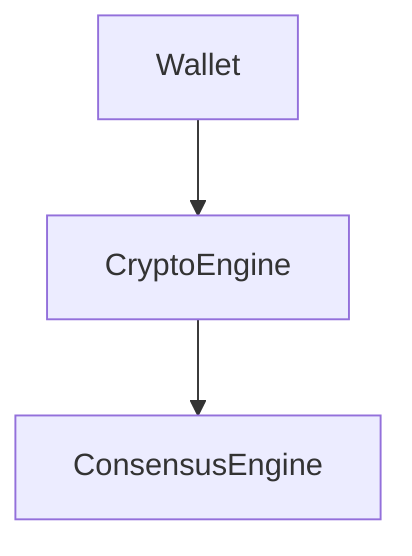

GBIP-0000
GlobalBoost Improvement Proposal System

1. Introduction
2. Abstract
3. Motivation
4. Vision
5. Goals
6. Terminology
7. RFC Keywords (MUST, SHOULD, MAY)
8. Proposal Categories
9. Proposal Lifecycle
10. Proposal States
11. Proposal Numbering
12. Repository Structure
13. Document Format
14. Markdown Style Guide
15. Naming Conventions
16. Proposal Metadata
17. Security Review
18. Consensus Review
19. Cryptographic Review
20. Performance Review
21. Testing Requirements
22. Acceptance Process
23. Release Process
24. Deprecation Process
25. Governance
26. Revision History
27. Initial GBIP Series
28. References
29. Appendices


# 1. Introduction

The GlobalBoost project is committed to building a secure, maintainable, and forward-looking blockchain platform. As the software ecosystem evolves, architectural decisions become increasingly significant and can influence development for many years. To ensure these decisions are documented, reviewed, and preserved, the project adopts the **GlobalBoost Governance & Improvement Proposal (GBIP)** process.

A GBIP is a permanent engineering specification that records the motivation, design, technical details, implementation strategy, and long-term implications of a proposed change. Rather than relying solely on discussions in pull requests, issue trackers, or chat platforms, important decisions are captured in a structured, version-controlled document that becomes part of the project's technical history.

The GBIP process promotes collaboration by encouraging discussion before implementation. Contributors are expected to present the problem being solved, evaluate alternative approaches, describe security and compatibility considerations, and define a clear migration strategy when applicable. This process improves transparency, reduces architectural drift, and provides future contributors with the context needed to understand why specific design decisions were made.

GBIPs cover a broad range of topics, including consensus rules, cryptographic systems, wallet architecture, networking, performance optimization, testing methodologies, development processes, and project governance. While not every code change requires a GBIP, any modification with long-term architectural or ecosystem impact should be documented through this process.

The GBIP repository serves as the canonical technical reference for the GlobalBoost ecosystem. It complements the source code by documenting the intent behind the implementation. When maintained together, the specifications and the software provide a complete engineering record that supports long-term maintenance, onboarding of new contributors, and future innovation.

This document, **GBIP-0000**, defines the proposal system itself. It establishes the terminology, document structure, lifecycle, review process, numbering scheme, governance model, and publication standards that apply to all subsequent GBIPs. Future specifications build upon these foundations to ensure consistency throughout the GlobalBoost engineering documentation.

The objectives of the GBIP system are to:

- Establish a transparent and documented engineering process.
- Encourage technical review before implementation.
- Preserve architectural knowledge over the lifetime of the project.
- Promote consistency across all technical documentation.
- Improve collaboration between contributors.
- Provide a stable foundation for future development.

By adopting the GBIP process, the GlobalBoost project recognizes that high-quality engineering begins with high-quality design. Every significant technical decision should be explainable, reviewable, and reproducible, ensuring that the project's evolution is guided by documented reasoning rather than historical accident.


# 2. Abstract

The GlobalBoost Governance & Improvement Proposal (GBIP) system defines the official process for proposing, documenting, reviewing, approving, implementing, and maintaining significant technical changes within the GlobalBoost ecosystem.

A GBIP is a permanent, version-controlled engineering specification that records the motivation, design, technical details, implementation strategy, and long-term implications of a proposal. The GBIP process ensures that important architectural and protocol decisions are documented in a consistent and transparent manner, providing a reliable reference for contributors, maintainers, auditors, and future developers.

The GBIP series covers a broad range of technical subjects, including blockchain consensus, cryptographic architecture, networking, wallet design, mining, performance optimization, security, testing, development processes, and project governance. By separating design from implementation, GBIPs establish a stable foundation for collaborative development while preserving the reasoning behind major engineering decisions.

This document, **GBIP-0000**, defines the governance framework for the entire GBIP series. It specifies the proposal lifecycle, document structure, numbering conventions, review and acceptance process, publication standards, and maintenance policies that apply to all subsequent GBIPs.

The objective of the GBIP system is to promote high-quality engineering through clear specifications, technical review, and long-term documentation. By adopting a formal proposal process, the GlobalBoost project aims to improve maintainability, encourage collaboration, reduce architectural ambiguity, and provide a durable technical record that supports the continued evolution of the ecosystem.

# 3. Motivation

The GlobalBoost ecosystem is expected to evolve continuously as new technologies, security requirements, and user expectations emerge. Over time, the project will incorporate architectural improvements, consensus enhancements, cryptographic innovations, performance optimizations, and new software components. Without a structured process for documenting these changes, valuable engineering knowledge can be lost, leading to inconsistent design decisions, duplicated effort, and increased maintenance costs.

Historically, many open-source software projects—including blockchain projects—have relied on issue trackers, pull requests, chat discussions, or informal documentation to record major technical decisions. While these communication channels are essential during development, they are not intended to serve as permanent engineering references. Discussions become fragmented, design rationale is difficult to locate, and future contributors often lack the historical context necessary to understand why a particular solution was chosen.

The GBIP system addresses these challenges by providing a standardized framework for documenting significant technical proposals before implementation begins. Each GBIP captures the motivation behind a proposal, evaluates alternative approaches, identifies potential risks, and describes the intended implementation strategy. This process encourages careful engineering analysis and promotes informed technical discussion before changes become part of the codebase.

The proposal system also strengthens collaboration. Contributors from different backgrounds can review a common specification, identify potential issues early, and suggest improvements before implementation resources are committed. This collaborative review process reduces the likelihood of architectural inconsistencies and encourages decisions based on technical merit rather than implementation convenience.

For maintainers, GBIPs provide a long-term record of the project's technical evolution. Every accepted proposal becomes part of the project's engineering history, allowing future developers to understand not only what was implemented, but also the reasoning, assumptions, and trade-offs that influenced those decisions. This historical record is particularly valuable for consensus-critical software, where even small modifications may have significant long-term consequences.

The GBIP process is also intended to improve software quality. By requiring proposals to consider security, compatibility, testing, migration strategies, and long-term maintenance before implementation, the project encourages a design-first engineering culture. Well-defined specifications reduce ambiguity, simplify code review, and improve the consistency of implementation across different contributors and future releases.

As GlobalBoost expands beyond a traditional cryptocurrency implementation into a broader blockchain ecosystem—including reusable cryptographic libraries, lightweight clients, modular node components, privacy technologies, and post-quantum cryptography—the need for comprehensive technical documentation becomes increasingly important. The GBIP framework provides the governance necessary to coordinate these efforts while preserving architectural consistency.

Ultimately, the motivation behind the GBIP system is to establish a transparent, disciplined, and durable engineering process. The objective is not to introduce unnecessary bureaucracy, but to ensure that important technical decisions are carefully documented, openly reviewed, and permanently preserved for the benefit of the GlobalBoost project and its community.

# 4. Vision

The long-term vision of the GlobalBoost ecosystem is to become a modern, modular, secure, and extensible blockchain platform that can evolve without sacrificing consensus stability.

GlobalBoost aims to combine the proven reliability of Bitcoin's architecture with modern software engineering practices, enabling future technologies such as post-quantum cryptography, privacy-preserving transactions, lightweight clients, reusable cryptographic libraries, and high-performance implementations.

The project seeks to establish a sustainable engineering culture in which technical decisions are driven by clear specifications, rigorous review, and long-term maintainability.

# 5. Engineering Philosophy

Every engineering decision within GlobalBoost SHOULD follow the following principles.

1. Specification before implementation.

2. Consensus correctness above all other concerns.

3. Security by design.

4. Simplicity over unnecessary complexity.

5. Modularity over monolithic design.

6. Backward compatibility whenever practical.

7. Performance through measurement, not assumption.

8. Documentation is part of the implementation.

9. Testability is a design requirement.

10. Long-term maintainability takes precedence over short-term convenience.

# 6. Goals

The GlobalBoost Governance & Improvement Proposal (GBIP) system exists to establish a consistent, transparent, and durable engineering process for the GlobalBoost ecosystem. The objectives defined in this section serve as the guiding principles for the proposal process and provide measurable outcomes against which the effectiveness of the GBIP system can be evaluated.

The primary goals of the GBIP system are as follows.

## 6.1 Standardize Technical Documentation

The GBIP system SHALL provide a standardized format for documenting significant technical proposals. Every proposal SHOULD follow a consistent structure, terminology, and review process to ensure readability, maintainability, and long-term accessibility.

A common documentation standard enables contributors to understand proposals regardless of their technical domain or original author.

---

## 6.2 Encourage Design Before Implementation

Significant architectural and protocol changes SHOULD be specified and reviewed before implementation begins.

The proposal process encourages contributors to evaluate design alternatives, identify potential risks, and document technical decisions before development resources are committed.

Design-first engineering reduces ambiguity, improves implementation quality, and simplifies future maintenance.

---

## 6.3 Preserve Engineering Knowledge

Every accepted GBIP SHALL become part of the permanent engineering history of the GlobalBoost project.

The specification SHALL document not only the final design, but also the motivation, assumptions, trade-offs, compatibility considerations, and security implications that influenced the decision.

This historical record assists future contributors in understanding why specific solutions were adopted.

---

## 6.4 Improve Collaboration

The GBIP process SHOULD encourage constructive technical discussion among contributors, maintainers, reviewers, and the broader community.

Documented proposals provide a common reference that allows participants to evaluate ideas objectively and contribute improvements before implementation begins.

---

## 6.5 Improve Software Quality

By requiring proposals to consider architecture, security, testing, compatibility, migration, and long-term maintenance, the GBIP process promotes higher quality software engineering.

Engineering decisions SHOULD be supported by technical reasoning rather than implementation convenience.

---

## 6.6 Promote Architectural Consistency

The GBIP process SHALL encourage consistent architectural principles across all GlobalBoost software components.

Independent proposals SHOULD complement one another rather than introduce conflicting design philosophies.

Consistency simplifies development, testing, documentation, and future evolution of the project.

---

## 6.7 Support Long-Term Evolution

The GlobalBoost ecosystem is expected to evolve over many years.

The GBIP process SHALL provide a stable framework capable of accommodating future technologies, including but not limited to:

- Modern cryptographic algorithms
- Post-quantum cryptography
- Privacy-enhancing technologies
- Lightweight clients
- Modular node architecture
- Performance optimizations
- New developer tooling

without requiring changes to the proposal system itself.

---

## 6.8 Improve Transparency

Major engineering decisions SHOULD be documented in a manner that is accessible to contributors and users.

Transparent documentation improves trust, facilitates independent review, and provides a clear record of the project's technical direction.

---

## 6.9 Facilitate Independent Review

GBIPs are intended to support independent technical evaluation by developers, researchers, auditors, and ecosystem participants.

Each proposal SHOULD provide sufficient technical detail to allow reviewers to understand the design, identify potential concerns, and assess implementation feasibility without requiring prior knowledge of informal discussions.

---

## 6.10 Establish a Living Engineering Standard

The GBIP repository SHALL serve as the authoritative engineering reference for the GlobalBoost ecosystem.

As the project evolves, new proposals will extend or refine existing specifications while preserving the historical record of previous decisions.

The proposal system is therefore intended to function as a living body of engineering standards rather than a static collection of design documents.

---

# Summary

The goals of the GBIP system are to:

- Standardize technical documentation.
- Encourage specification before implementation.
- Preserve engineering knowledge.
- Improve collaboration.
- Improve software quality.
- Promote architectural consistency.
- Support long-term project evolution.
- Improve transparency.
- Facilitate independent technical review.
- Establish a permanent engineering standards repository.

# 7. Terminology

This section defines the terminology used throughout the GlobalBoost Governance & Improvement Proposal (GBIP) series. Unless explicitly stated otherwise, the following definitions apply to all GBIP documents.

---

## 7.1 GlobalBoost

**GlobalBoost** refers to the complete open-source blockchain ecosystem, including the blockchain protocol, the GlobalBoost-Y (BSTY) reference implementation, cryptographic libraries, wallets, networking software, developer tools, documentation, and supporting infrastructure.

---

## 7.2 GlobalBoost-Y (BSTY)

**GlobalBoost-Y (BSTY)** is the reference implementation of the GlobalBoost blockchain protocol.

Unless otherwise specified, references to BSTY refer to the official full node software developed by the GlobalBoost project.

---

## 7.3 GBIP

A **GlobalBoost Governance & Improvement Proposal (GBIP)** is a permanent engineering specification that documents a significant technical, architectural, governance, or process-related proposal within the GlobalBoost ecosystem.

Each GBIP is uniquely identified by a numerical identifier.

---

## 7.4 Proposal

A **proposal** is a documented recommendation describing a new feature, architectural modification, process improvement, or governance change that is intended for technical review.

A proposal becomes a GBIP after receiving an official identifier.

---

## 7.5 Contributor

A **Contributor** is any individual who submits documentation, source code, bug reports, design proposals, tests, reviews, or other contributions to the GlobalBoost project.

---

## 7.6 Maintainer

A **Maintainer** is a contributor with responsibility for reviewing, approving, or managing one or more components of the GlobalBoost ecosystem.

Maintainers are responsible for preserving technical quality, architectural consistency, and project integrity.

---

## 7.7 Reviewer

A **Reviewer** is a contributor who performs an independent technical evaluation of a proposal.

Reviewers may provide recommendations regarding correctness, security, compatibility, performance, documentation quality, or implementation feasibility.

---

## 7.8 Consensus

**Consensus** refers to the set of protocol rules that determine blockchain validity and ensure that all conforming nodes independently reach the same view of the blockchain.

Consensus changes require exceptional care because incompatible implementations may lead to network divergence.

---

## 7.9 Consensus-Critical

A component is **Consensus-Critical** if incorrect behavior could cause a node to accept or reject blocks or transactions differently from other conforming nodes.

Consensus-critical software requires rigorous specification, testing, and review.

---

## 7.10 Reference Implementation

The **Reference Implementation** is the official GlobalBoost-Y software used as the primary implementation of the GlobalBoost protocol.

While alternative implementations are permitted, the reference implementation serves as the baseline for protocol behavior.

---

## 7.11 Specification

A **Specification** is a normative technical document describing the intended behavior, architecture, interfaces, or requirements of a software component.

Specifications describe expected behavior independently of implementation details.

---

## 7.12 Implementation

An **Implementation** is executable software that conforms to one or more GBIP specifications.

Multiple implementations may exist provided they remain compatible with the applicable specifications.

---

## 7.13 Backward Compatibility

**Backward Compatibility** refers to the ability of newer software versions to interoperate with data, interfaces, or behavior produced by earlier supported versions.

---

## 7.14 Breaking Change

A **Breaking Change** is any modification that intentionally alters externally observable behavior in a manner that is incompatible with previous specifications or supported software versions.

Breaking changes require explicit justification and a documented migration strategy.

---

## 7.15 Soft Fork

A **Soft Fork** is a consensus change that restricts previously valid behavior while remaining compatible with nodes that have not upgraded, provided those nodes continue to follow the longest valid chain.

---

## 7.16 Hard Fork

A **Hard Fork** is a consensus change that introduces rules that are not compatible with previous protocol versions, requiring all participating nodes to upgrade in order to remain on the same blockchain.

---

## 7.17 Module

A **Module** is a logical software component with clearly defined responsibilities and interfaces.

Examples include the Crypto Engine, Wallet, P2P Networking, Mining, RPC Server, and Database Layer.

---

## 7.18 API

An **Application Programming Interface (API)** is a defined contract through which software components communicate.

Public APIs SHOULD maintain compatibility whenever practical.

---

## 7.19 Cryptographic Primitive

A **Cryptographic Primitive** is a fundamental cryptographic algorithm or operation, such as a hash function, digital signature algorithm, key derivation function, or random number generator.

---

## 7.20 Canonical Document

The **Canonical Document** is the authoritative version of a GBIP stored in the official GlobalBoost GBIP repository.

Generated PDF, HTML, or DOCX versions are convenience formats and MUST remain consistent with the canonical Markdown source.

---

## 7.21 Ecosystem

The **GlobalBoost Ecosystem** encompasses all software, documentation, infrastructure, libraries, services, and community processes developed under the GlobalBoost project.

---

## 7.22 RFC 2119 Keywords

The capitalized terms **MUST**, **MUST NOT**, **REQUIRED**, **SHALL**, **SHALL NOT**, **SHOULD**, **SHOULD NOT**, **RECOMMENDED**, **NOT RECOMMENDED**, **MAY**, and **OPTIONAL** are interpreted as described in RFC 2119 and RFC 8174 when they appear in uppercase within a GBIP.

---

# 7.23 Crypto Engine

The **Crypto Engine** is the cryptographic subsystem of the GlobalBoost ecosystem.

It provides a unified interface for cryptographic operations including, but not limited to:

- Hash algorithms
- Digital signatures
- Key derivation
- Random number generation
- Memory-hard algorithms
- SIMD acceleration
- Post-quantum cryptography

The Crypto Engine SHALL be modular and algorithm-agnostic, allowing cryptographic primitives to evolve without affecting unrelated software components.

See GBIP-0001.

---

# 7.24 Consensus Engine

The **Consensus Engine** is the subsystem responsible for validating blockchain state according to the active consensus rules.

Responsibilities include:

- Block validation
- Transaction validation
- Difficulty adjustment
- Script execution
- Signature verification
- Chain selection
- Consensus upgrades

Consensus correctness SHALL take precedence over execution performance.

See GBIP-0010.

---

# 7.25 Network Engine

The **Network Engine** manages peer-to-peer communication within the GlobalBoost ecosystem.

Responsibilities include:

- Peer discovery
- Message serialization
- Inventory synchronization
- Block propagation
- Transaction relay
- Network security

---

# 7.26 Wallet Engine

The **Wallet Engine** manages user keys and transaction creation.

Responsibilities include:

- Address generation
- Key storage
- Transaction construction
- Coin selection
- Signing
- View keys
- Hardware wallet support

Wallet functionality SHALL remain independent from consensus validation.

---

# 7.27 Mining Engine

The **Mining Engine** performs proof-of-work operations and block template generation.

Its design SHOULD permit future mining algorithms without requiring major architectural changes.

---

# 7.28 Privacy Engine

The **Privacy Engine** provides optional transaction privacy mechanisms.

Potential capabilities include:

- View Keys
- Stealth Addresses
- Confidential Transactions
- Ring Signatures
- Zero-Knowledge Proofs

Privacy mechanisms SHOULD remain modular to allow future cryptographic upgrades.

See GBIP-0007.

---

# 7.29 Storage Engine

The **Storage Engine** manages persistent blockchain data.

Responsibilities include:

- Block database
- Chainstate
- UTXO storage
- Metadata
- Snapshot support
- Pruning

---

# 7.30 Script Engine

The **Script Engine** evaluates transaction locking and unlocking scripts according to the active consensus rules.

Future scripting extensions SHALL preserve deterministic execution.

---

# 7.31 SIMD Engine

The **SIMD Engine** provides hardware-accelerated implementations of selected computational routines.

Supported instruction sets MAY include:

- SSE2
- SSE4.2
- AVX2
- AVX-512
- ARM NEON

Implementations MUST produce identical results across all supported architectures.

See GBIP-0003.

---

# 7.32 Light Client

A **Light Client** is a node that verifies blockchain information without maintaining the complete blockchain database.

Light clients SHOULD maximize security while minimizing bandwidth, storage, and computational requirements.

See GBIP-0008.

---

# 7.33 Modular Architecture

**Modular Architecture** is the engineering principle whereby software components communicate through stable, well-defined interfaces rather than direct implementation dependencies.

Each engine SHOULD be independently testable, replaceable, and maintainable.

# 8. Proposal Categories

Every GlobalBoost Governance & Improvement Proposal (GBIP) SHALL be assigned to one primary category. Proposal categories provide a consistent method for classifying specifications, determining the appropriate review process, and identifying subject matter experts.

A proposal MAY reference multiple technical domains; however, one category SHALL be designated as the primary classification.

---

# 8.1 Standards Track

Standards Track proposals define or modify the technical architecture of the GlobalBoost ecosystem.

These proposals generally introduce new functionality or significantly modify existing behavior.

Examples include:

- Software architecture
- Public APIs
- Node components
- Wallet functionality
- Storage systems
- Cryptographic libraries

Standards Track proposals typically require technical review and implementation before reaching Final status.

---

# 8.2 Consensus

Consensus proposals modify rules that determine blockchain validity.

Examples include:

- Block validation rules
- Transaction validation
- Difficulty adjustment
- Script execution
- Signature verification
- Address formats
- Soft forks
- Hard forks

Consensus proposals SHALL receive the highest level of technical review because incompatible implementations may lead to blockchain divergence.

---

# 8.3 Cryptography

Cryptography proposals define new cryptographic primitives or modify existing cryptographic systems.

Examples include:

- Hash algorithms
- Digital signatures
- Key derivation
- Random number generation
- Post-quantum cryptography
- Hybrid signatures
- Cryptographic protocols

Security review is REQUIRED for all cryptographic proposals.

---

# 8.4 Privacy

Privacy proposals define mechanisms intended to improve user privacy while preserving protocol correctness.

Examples include:

- View Keys
- Stealth Addresses
- Confidential Transactions
- Ring Signatures
- Zero-Knowledge Proofs
- Transaction metadata protection

Privacy proposals SHOULD include an analysis of security, performance, compatibility, and regulatory considerations.

---

# 8.5 Mining

Mining proposals define proof-of-work algorithms, mining infrastructure, and related optimizations.

Examples include:

- Proof-of-Work algorithms
- Difficulty algorithms
- Block template generation
- Mining APIs
- Hardware optimization
- SIMD acceleration
- FPGA support
- ASIC compatibility

---

# 8.6 Wallet

Wallet proposals define wallet behavior and user-facing cryptographic functionality.

Examples include:

- Address formats
- HD wallets
- Key management
- Hardware wallets
- Transaction creation
- Coin selection
- Wallet APIs

Wallet proposals SHOULD preserve compatibility with existing wallets whenever practical.

---

# 8.7 Networking

Networking proposals define peer-to-peer communication and node interoperability.

Examples include:

- P2P messages
- Transport protocols
- Peer discovery
- Block relay
- Transaction propagation
- Network security

---

# 8.8 Performance

Performance proposals improve efficiency without changing externally observable behavior.

Examples include:

- SIMD optimization
- Memory optimization
- Parallel execution
- Database improvements
- Cache design

Performance proposals SHALL include benchmark results demonstrating measurable improvements.

---

# 8.9 Security

Security proposals improve the resilience of the GlobalBoost ecosystem.

Examples include:

- Secure coding practices
- Attack mitigation
- Key protection
- Memory safety
- Cryptographic hardening
- Supply chain security

Security review is REQUIRED.

---

# 8.10 Testing

Testing proposals define quality assurance methodologies.

Examples include:

- Unit testing
- Integration testing
- Fuzz testing
- Regression testing
- Benchmarking
- Continuous Integration

---

# 8.11 Process

Process proposals define project governance and development workflow.

Examples include:

- Release process
- Contribution guidelines
- Coding standards
- Documentation standards
- Review procedures

Process proposals generally affect contributors rather than software behavior.

---

# 8.12 Informational

Informational proposals provide guidance or research but do not define mandatory behavior.

Examples include:

- Design rationale
- Research papers
- Historical analysis
- Comparative studies
- Performance evaluations

Informational GBIPs do not establish normative requirements.

---

# 8.13 Meta

Meta proposals modify the GBIP system itself.

Examples include:

- Proposal templates
- Numbering rules
- Document structure
- Governance of the GBIP repository
- Review procedures

GBIP-0000 is itself a Meta proposal.

---

# Category Selection

Every proposal SHALL identify its primary category in the document metadata.

Example:

Category: Consensus

Type: Standards Track

Status: Draft

# 9. Proposal Lifecycle

Every GlobalBoost Governance & Improvement Proposal (GBIP) progresses through a defined lifecycle. The lifecycle ensures that proposals are reviewed, discussed, implemented, and maintained in a consistent and transparent manner.

The lifecycle is intended to encourage technical collaboration while preserving a permanent record of engineering decisions.

A proposal SHALL exist in exactly one lifecycle state at any given time.

---

# 9.1 Lifecycle Overview

```
                    +-------------+
                    |    IDEA     |
                    +------+------+ 
                           |
                           v
                    +-------------+
                    |    DRAFT    |
                    +------+------+ 
                           |
                           v
                    +-------------+
                    |   REVIEW    |
                    +------+------+ 
                    |             |
          Rejected  |             | Accepted
                    |             |
                    v             v
             +------------+  +-------------+
             | REJECTED   |  |  ACCEPTED   |
             +------------+  +------+------+
                                    |
                                    v
                             +-------------+
                             |IMPLEMENTED  |
                             +------+------+
                                    |
                                    v
                             +-------------+
                             |    FINAL    |
                             +-------------+
```

Additional lifecycle states include:

- Deferred
- Withdrawn
- Superseded

---

# 9.2 Idea

An **Idea** is an informal proposal that has not yet entered the GBIP process.

Ideas may originate from:

- Contributors
- Maintainers
- Researchers
- Community members

Ideas are typically discussed through GitHub Discussions, Issues, mailing lists, or other communication channels.

An Idea has no GBIP number.

---

# 9.3 Draft

A proposal enters the **Draft** state after receiving a GBIP number.

Draft proposals SHALL contain:

- Abstract
- Motivation
- Technical Specification
- Security Considerations
- Compatibility Analysis
- References

Draft proposals are expected to evolve based on technical feedback.

Major changes are permitted during this phase.

---

# 9.4 Review

A proposal enters **Review** when the author believes the specification is technically complete.

The review process evaluates:

- Technical correctness
- Security
- Consensus implications
- Maintainability
- Performance
- Testing strategy
- Documentation quality

Reviewers MAY request revisions before approval.

No implementation is required for a proposal to enter Review.

---

# 9.5 Accepted

A proposal becomes **Accepted** after maintainers determine that:

- the problem is well defined;
- the specification is technically sound;
- security considerations have been addressed;
- implementation is considered feasible; and
- sufficient technical review has occurred.

Acceptance indicates approval of the specification.

Acceptance does NOT imply that implementation has already begun.

---

# 9.6 Implemented

A proposal enters **Implemented** after the approved specification has been incorporated into the reference implementation.

Implementation SHOULD include:

- source code;
- automated tests;
- documentation updates; and
- migration support where applicable.

Implementation SHOULD conform to the accepted specification.

---

# 9.7 Final

A proposal reaches **Final** when:

- implementation is complete;
- testing has been successfully performed;
- documentation has been updated; and
- the implementation has been released.

Final proposals represent the authoritative engineering specification for the implemented feature.

---

# 9.8 Deferred

A proposal MAY be marked **Deferred** if work is intentionally postponed.

Examples include:

- dependency on future work;
- insufficient development resources;
- changing project priorities.

Deferred proposals may return to Draft without receiving a new GBIP number.

---

# 9.9 Withdrawn

The author MAY voluntarily withdraw a proposal.

Withdrawn proposals remain part of the historical record.

A withdrawn proposal SHALL NOT be deleted.

---

# 9.10 Rejected

A proposal MAY be rejected if:

- the technical approach is unsound;
- security concerns cannot be resolved;
- the proposal conflicts with project goals;
- a superior alternative exists; or
- consensus among reviewers cannot be reached.

Rejected proposals remain permanently archived.

---

# 9.11 Superseded

A proposal becomes **Superseded** when a newer GBIP replaces it.

The superseding GBIP SHALL explicitly reference the previous proposal.

Historical proposals SHALL remain available for reference.

---

# 9.12 State Transitions

The normal progression is:

```
Idea
  │
  ▼
Draft
  │
  ▼
Review
  │
  ▼
Accepted
  │
  ▼
Implemented
  │
  ▼
Final
```

Alternative transitions include:

```
Draft
   ├──► Withdrawn

Draft
   ├──► Deferred

Review
   ├──► Rejected

Final
   ├──► Superseded
```

---

# 9.13 Lifecycle Principles

The proposal lifecycle is governed by the following principles:

- Every proposal SHALL preserve its historical record.
- Proposal identifiers SHALL never be reused.
- Proposal status SHALL accurately reflect current progress.
- Significant technical discussion SHOULD occur before implementation.
- Acceptance SHALL be based on technical merit.
- Final proposals SHOULD remain stable except for editorial corrections.

# 10. Proposal States

Every GlobalBoost Governance & Improvement Proposal (GBIP) SHALL have exactly one official status at any given time. The status communicates the current maturity, review level, and implementation progress of the proposal.

Proposal status SHALL be recorded in the document metadata and updated whenever the proposal changes state.

Example:

Status: Draft

---

# 10.1 Idea

An **Idea** represents an informal concept that has not yet entered the GBIP process.

Ideas are discussed within the community but have not yet been assigned a GBIP identifier.

Characteristics:

- No GBIP number
- No formal review
- No implementation requirement

---

# 10.2 Draft

A **Draft** is an active proposal under development.

Draft proposals are expected to change as technical discussion continues.

Characteristics:

- Assigned GBIP number
- Publicly available
- Open for discussion
- Subject to major revisions

---

# 10.3 Experimental

An **Experimental** proposal describes a technology or design that requires practical evaluation before it can be considered for standardization.

Experimental proposals are intended to encourage innovation while minimizing consensus risk.

Typical examples include:

- New cryptographic algorithms
- Hybrid signature systems
- Privacy technologies
- Alternative mining algorithms
- Performance optimizations
- Prototype networking protocols

Experimental status SHALL NOT imply acceptance.

---

# 10.4 Review

A proposal enters **Review** when the author believes the specification is technically complete.

Review focuses on:

- correctness
- completeness
- security
- compatibility
- maintainability
- testing
- implementation feasibility

Reviewers MAY request revisions before acceptance.

---

# 10.5 Accepted

An **Accepted** proposal has received approval from the project maintainers.

Acceptance indicates agreement with the specification.

Acceptance does NOT guarantee implementation.

---

# 10.6 Implemented

An **Implemented** proposal has been incorporated into the reference implementation.

Implementation SHOULD include:

- source code
- automated tests
- documentation
- migration support where applicable

---

# 10.7 Final

A proposal reaches **Final** when the implementation has been released and is considered stable.

Final proposals represent the authoritative engineering specification for that feature.

Editorial improvements MAY continue.

Technical changes require a new GBIP or a superseding proposal.

---

# 10.8 Deferred

A proposal may be marked **Deferred** when development is intentionally postponed.

Examples include:

- dependency on future work
- insufficient resources
- changing priorities

Deferred proposals remain active but inactive.

---

# 10.9 Withdrawn

A proposal may be **Withdrawn** by its author before acceptance.

Withdrawn proposals remain permanently archived.

Proposal identifiers SHALL NOT be reused.

---

# 10.10 Rejected

A proposal becomes **Rejected** when it is determined that it should not proceed.

Reasons may include:

- technical deficiencies
- unresolved security concerns
- architectural conflicts
- superior alternatives
- lack of community support

Rejected proposals remain part of the historical record.

---

# 10.11 Superseded

A proposal becomes **Superseded** when another GBIP replaces it.

The replacement GBIP SHALL explicitly reference the superseded proposal.

Superseded proposals remain available for historical reference.

---

# 10.12 Obsolete

An **Obsolete** proposal describes functionality that is no longer applicable to the current GlobalBoost ecosystem.

Unlike a superseded proposal, there may be no direct replacement.

Examples include:

- retired APIs
- discontinued software components
- deprecated network protocols

Obsolete proposals remain archived for historical completeness.

---

# 10.13 Status Summary

| Status | Description |
|---------|-------------|
| Idea | Informal concept |
| Draft | Active specification under development |
| Experimental | Prototype requiring evaluation |
| Review | Under formal technical review |
| Accepted | Specification approved |
| Implemented | Implemented in the reference software |
| Final | Stable engineering standard |
| Deferred | Development postponed |
| Withdrawn | Withdrawn by the author |
| Rejected | Proposal declined |
| Superseded | Replaced by another GBIP |
| Obsolete | No longer applicable |

---

# 10.14 Status Principles

The following principles apply to all proposal states:

- Every GBIP SHALL have exactly one status.
- Status SHALL accurately reflect the proposal's maturity.
- Historical statuses SHALL remain part of the revision history.
- Proposal identifiers SHALL never be reused.
- Final proposals SHOULD remain technically stable.
- Superseded and Obsolete proposals SHALL remain publicly accessible.

# 11. Proposal Numbering

Every GlobalBoost Governance & Improvement Proposal (GBIP) SHALL be assigned a unique numerical identifier.

Proposal identifiers provide a permanent reference for engineering specifications and SHALL remain unchanged throughout the lifetime of the proposal.

Once assigned, a GBIP number SHALL NEVER be reused, even if the proposal is withdrawn, rejected, or superseded.

---

# 11.1 Identifier Format

Every proposal SHALL use the following format:

GBIP-XXXX

where **XXXX** is a four-digit decimal number.

Examples:

GBIP-0000

GBIP-0001

GBIP-0214

GBIP-1050

Leading zeros SHALL be preserved.

---

# 11.2 Assignment

Proposal numbers are assigned by the GBIP Editors.

Numbers SHOULD be assigned only after:

- the proposal has sufficient technical content;
- the author intends to continue development; and
- the proposal has entered the Draft state.

Ideas and informal discussions SHALL NOT receive a GBIP number.

---

# 11.3 Permanence

A GBIP identifier is permanent.

Identifiers SHALL NOT change because of:

- title changes;
- author changes;
- status changes;
- category changes;
- implementation progress.

Historical references MUST continue to resolve to the same proposal.

---

# 11.4 Reserved Ranges

To improve repository organization, proposal numbers are grouped into functional ranges.

| Range | Area |
|--------|-------------------------------|
| 0000–0099 | Governance & Architecture |
| 0100–0199 | Consensus |
| 0200–0299 | Cryptography |
| 0300–0399 | Networking |
| 0400–0499 | Wallet |
| 0500–0599 | Mining |
| 0600–0699 | Privacy |
| 0700–0799 | Performance |
| 0800–0899 | Developer Tools |
| 0900–0999 | Testing & Quality |
| 1000–1999 | Future Reserved |

Reserved ranges MAY be expanded by future GBIPs.

---

# 11.5 Number Reservation

Proposal numbers MAY be reserved for planned work.

Reserved numbers SHALL NOT be published until the corresponding Draft proposal exists.

Example:

GBIP-0206

Reserved for Hybrid Digital Signatures

---

# 11.6 Historical Preservation

Withdrawn, Rejected, Deferred, Superseded, and Obsolete proposals SHALL retain their original identifiers.

Historical identifiers SHALL remain permanently accessible.

---

# 11.7 References

References to other proposals SHOULD use the complete identifier.

Examples:

GBIP-0000

GBIP-0006

GBIP-0212

When practical, references SHOULD also include the proposal title.

Example:

GBIP-0001 — Crypto Engine

---

# 11.8 Examples

Examples of valid identifiers:

GBIP-0000

GBIP-0008

GBIP-0101

GBIP-0217

GBIP-0412

GBIP-0604

GBIP-1001

---

# 11.9 Numbering Principles

The numbering system is designed to satisfy the following objectives:

- Provide permanent identifiers.
- Preserve historical references.
- Improve repository navigation.
- Simplify proposal discovery.
- Organize specifications by engineering domain.
- Allow future expansion without renumbering existing proposals.

# 12. Repository Structure

The GlobalBoost Governance & Improvement Proposal (GBIP) repository is the canonical source for all engineering specifications within the GlobalBoost ecosystem.

The repository is designed to provide a consistent, maintainable, and scalable documentation structure that supports long-term project evolution.

All official GBIP documents SHALL reside within this repository.

---

# 12.1 Objectives

The repository structure is designed to achieve the following objectives:

- Maintain a single authoritative source for all specifications.
- Separate documentation from implementation.
- Simplify navigation for contributors.
- Support automatic documentation generation.
- Enable long-term version control.
- Preserve the historical evolution of every proposal.

---

# 12.2 Canonical Source

The canonical representation of every GBIP SHALL be written in Markdown.

Generated formats such as PDF, HTML, or DOCX are considered derived artifacts and SHALL NOT replace the Markdown source.

```
Markdown
      │
      ├── HTML
      ├── PDF
      ├── DOCX
      └── EPUB
```

All generated documents MUST remain consistent with the canonical Markdown version.

---

# 12.3 Repository Layout

The repository SHOULD follow the structure below.

```text
GlobalBoost-GBIPs/

├── README.md
├── LICENSE
├── CHANGELOG.md
├── CONTRIBUTING.md
├── CODE_OF_CONDUCT.md
├── GOVERNANCE.md
├── SECURITY.md
├── STYLE_GUIDE.md
├── TEMPLATE.md
├── mkdocs.yml
├── requirements.txt
│
├── docs/
│   ├── index.md
│   ├── roadmap.md
│   ├── governance.md
│   ├── glossary.md
│   ├── faq.md
│   ├── architecture.md
│   │
│   ├── assets/
│   │   ├── images/
│   │   ├── logos/
│   │   ├── icons/
│   │   └── css/
│   │
│   ├── diagrams/
│   │
│   └── gbips/
│       ├── gbip-0000.md
│       ├── gbip-0001.md
│       ├── ...
│       └── gbip-9999.md
│
├── templates/
│
├── scripts/
│
├── tools/
│
└── .github/
    ├── ISSUE_TEMPLATE/
    ├── workflows/
    └── PULL_REQUEST_TEMPLATE.md
```

---

# 12.4 Documentation Directory

The `docs/` directory contains all published documentation.

This directory SHALL include:

- Project documentation
- GBIP specifications
- Architecture documents
- Diagrams
- Static assets

No source code SHALL be stored within the documentation directory.

---

# 12.5 GBIP Directory

All proposal documents SHALL reside within:

```
docs/gbips/
```

Each proposal SHALL use the filename format:

```
gbip-XXXX.md
```

Examples:

```
gbip-0000.md
gbip-0001.md
gbip-0201.md
```

Filenames SHALL use lowercase letters.

---

# 12.6 Assets

Images, logos, icons, diagrams, and other static resources SHALL be stored under:

```
docs/assets/
```

Assets SHOULD be organized into logical subdirectories.

Example:

```
assets/

images/

logos/

icons/

css/
```

---

# 12.7 Diagrams

Architecture diagrams SHALL be stored separately from proposal documents.

Recommended formats include:

- Mermaid
- SVG
- PNG

Source diagrams SHOULD be version controlled.

Generated images SHOULD NOT replace editable sources.

---

# 12.8 Templates

The `templates/` directory contains reusable templates.

Examples include:

- GBIP template
- Decision Record
- Meeting Notes
- Architecture Review

Templates SHOULD remain generic and reusable.

---

# 12.9 Automation

Automation scripts MAY reside under:

```
scripts/
```

Examples include:

- PDF generation
- DOCX generation
- Link validation
- Table of contents generation
- Documentation validation

Automation SHALL NOT modify canonical Markdown files without explicit review.

---

# 12.10 GitHub Configuration

Repository-specific GitHub configuration SHALL be stored within:

```
.github/
```

Examples include:

- GitHub Actions
- Issue Templates
- Pull Request Templates
- Funding information
- CODEOWNERS

---

# 12.11 Version Control

The repository SHALL be maintained using Git.

Every modification SHOULD be traceable through commit history.

No generated documentation SHALL be manually edited.

---

# 12.12 Documentation Principles

The repository SHALL follow these principles:

- Markdown is the canonical source.
- Every GBIP is permanently archived.
- Documentation is version controlled.
- Generated artifacts are reproducible.
- Directory organization SHALL remain stable.
- Repository history SHALL be preserved.

---

# 12.13 Future Expansion

The repository structure is intentionally modular.

Future directories MAY be added for:

- Reference implementations
- Design studies
- Benchmark reports
- Whitepapers
- Research documents
- API references

Expansion SHOULD preserve backward compatibility whenever practical.

13. Document Format

Every GlobalBoost Governance & Improvement Proposal (GBIP) SHALL follow a standardized document format. A consistent structure improves readability, simplifies technical review, enables automated tooling, and ensures long-term maintainability of the GBIP repository.

Unless otherwise specified, all GBIPs SHALL conform to the requirements defined in this section.

13.0 Standard Document Layout

Every GBIP SHALL follow the standardized layout defined below.

The opening sequence SHALL appear in the following order:

Standard Document Header
Document Information
Machine-Readable Metadata
Table of Contents
Abstract
Main Document

No section SHALL precede the Standard Document Header.

13.1 Standard Document Header

Every GBIP SHALL begin with a standardized header.

Example

==============================================================
GlobalBoost Governance & Improvement Proposal
==============================================================

GBIP-0001

Crypto Engine

Version 1.0

The document header exists solely for presentation and identification.

It SHALL NOT replace the metadata section.

13.2 Document Information

Immediately following the document header, every GBIP SHALL include a concise summary intended for human readers.

Example

Document Information

GBIP: 0001

Title: Crypto Engine

Document Class: Core Standard

Status: Draft

Type: Standards Track

Category: Cryptography

Engine: Crypto Engine

Version: 1.0

Author: John Doe

Created: 2026-09-05

Updated: 2026-09-08

This section SHOULD remain synchronized with the metadata.

13.3 Machine-Readable Metadata

Immediately following the Document Information section, every GBIP SHALL contain machine-readable metadata.

GBIP: 0001
Title: Crypto Engine

Document-Class: Core Standard

Author: John Doe

Status: Draft
Type: Standards Track
Category: Cryptography
Engine: Crypto Engine

Version: 1.0

Created: 2026-09-05
Updated: 2026-09-08

Requires: GBIP-0000
Replaces:
Replaced-By:

Discussion:

License: CC BY 4.0

Repository tooling MAY parse this section automatically.

13.3.1 Canonical Metadata Order

Every GBIP SHALL use the following field order.

GBIP
Title

Document-Class

Author

Status
Type
Category
Engine

Version

Created
Updated

Requires
Replaces
Replaced-By

Discussion

License

This order SHALL remain consistent throughout the entire GBIP repository.

13.3.2 Document Classification

Every proposal SHALL declare exactly one Document Class.

The Document Class defines the engineering purpose of the document.

It is independent of:

Proposal Type
Proposal Category
Proposal Status
Engine

Document Class SHALL remain stable unless the purpose of the proposal fundamentally changes.

Standard Classes
Document Class	Description
Core Standard	Fundamental architecture and governance specifications
Protocol Standard	Consensus, networking and blockchain protocol
Cryptographic Standard	Hashes, signatures, cryptography and key management
Engineering Standard	Coding standards, testing, documentation and benchmarks
Implementation Standard	APIs, libraries and implementation guidance
Best Current Practice (BCP)	Recommended engineering practices
Informational	Background, research and rationale
Experimental	Technology under evaluation

Future Document Classes MAY be introduced by Meta GBIPs.

13.4 Canonical Format

Markdown (GitHub Flavored Markdown) SHALL be the canonical document format.

Markdown is selected because it:

is human-readable
is version-control friendly
renders natively on GitHub
supports MkDocs
converts to HTML, PDF, DOCX and EPUB

Generated documents SHALL remain consistent with the Markdown source.

13.5 Character Encoding

Every GBIP SHALL:

Use UTF-8 encoding
Use Unix (LF) line endings
End with a trailing newline
Avoid tabs except inside code examples
13.6 Filename

Every proposal SHALL use the filename

gbip-XXXX.md

Examples

gbip-0000.md
gbip-0001.md
gbip-0201.md

Rules

lowercase
four digits
.md
filename MUST equal GBIP identifier
13.7 Required Sections

Standards Track proposals SHALL include at minimum:

Abstract
Motivation
Specification
Rationale
Backward Compatibility
Security Considerations
Performance Considerations
Testing
Reference Implementation (if applicable)
References
13.8 Headings

Use ATX headings.

# Chapter

## Section

### Subsection
13.9 Lists
Ordered lists for procedures.
Bullet lists for unordered information.
Deep nesting SHOULD be avoided.
13.10 Tables

Tables SHOULD be used whenever they improve readability.

Large datasets SHOULD be placed in appendices.

13.11 Code Examples

Code SHALL use fenced code blocks.

Example

bool VerifyBlock(...)
{
    ...
}

Language identifiers SHOULD always be specified.

13.12 Diagrams

Mermaid SHOULD be the preferred diagram language.

SVG MAY be used for complex diagrams.

Editable sources SHOULD always be preserved.

13.13 Cross References

Other proposals SHALL be referenced using their GBIP identifier.

Example

See GBIP-0001.

Titles SHOULD be included when useful.

See GBIP-0001 — Crypto Engine.
13.14 References

References SHALL be divided into

Normative References
Informative References
13.15 Language

Documents SHALL

use technical English
avoid ambiguity
define project-specific terminology
use RFC 2119 / RFC 8174 keywords where appropriate
13.16 Versioning

Documents SHOULD maintain an internal version.

Editorial revisions SHOULD increment the minor version.

Major revisions SHOULD either increment the major version or be replaced by a new GBIP.

13.17 Revision History

Every GBIP SHOULD include

Version	Date	Description
1.0	yyyy-mm-dd	Initial publication
1.1	yyyy-mm-dd	Editorial revision
13.18 Appendices

Appendices MAY contain

mathematical proofs
benchmarks
test vectors
migration guides
sample configurations

Appendices SHALL NOT replace normative requirements.

13.19 Document Quality Checklist

Every Draft proposal SHALL include a completed Quality Checklist before entering Review.

## Quality Checklist

### Administrative

- [ ] Metadata completed
- [ ] GBIP number assigned
- [ ] Document Class assigned
- [ ] Proposal Type assigned
- [ ] Category assigned
- [ ] Engine assigned

### Technical

- [ ] Abstract completed
- [ ] Motivation documented
- [ ] Specification complete
- [ ] Rationale documented
- [ ] Alternatives considered

### Compatibility

- [ ] Backward compatibility reviewed
- [ ] Migration strategy documented

### Security

- [ ] Security considerations completed
- [ ] Privacy implications reviewed
- [ ] Consensus implications reviewed

### Performance

- [ ] Performance impact documented
- [ ] Benchmarks included

### Testing

- [ ] Test plan completed
- [ ] Test vectors included
- [ ] Reference implementation available

### Documentation

- [ ] References verified
- [ ] Cross references verified
- [ ] Diagrams reviewed
- [ ] Grammar reviewed

The checklist MAY be expanded by future Meta GBIPs.

13.20 Document Principles

Every GBIP SHALL follow these principles:

Markdown is the canonical format.
Every proposal SHALL use the standardized opening layout.
Every proposal SHALL declare exactly one Document Class.
Every proposal SHALL use the canonical metadata field order.
Documents SHALL remain implementation-independent.
Generated documentation SHALL be reproducible.
Examples SHALL clarify normative text.
Every proposal SHALL include a completed Quality Checklist before Review.
Clarity, consistency, and long-term maintainability SHALL take precedence over brevity.

# 14. Markdown Style Guide

This chapter defines the official writing and formatting conventions for all GlobalBoost Governance & Improvement Proposals (GBIPs).

The objective of this style guide is to ensure that every proposal maintains a consistent appearance, terminology, and structure regardless of its author.

Unless otherwise specified, all GBIPs SHALL conform to this style guide.

---

# 14.1 General Principles

Every GBIP SHALL be:

- Clear
- Precise
- Concise
- Technically accurate
- Easy to review
- Easy to maintain

Authors SHOULD prioritize readability over brevity.

---

# 14.2 Language

GBIPs SHALL be written in English.

Authors SHOULD:

- use active voice whenever practical;
- avoid slang and colloquial language;
- avoid marketing terminology;
- define project-specific terminology;
- avoid unnecessary abbreviations.

Example:

Good

"The node validates every block."

Poor

"Blocks get validated."

---

# 14.3 Normative Language

Normative requirements SHALL use the terminology defined in RFC 2119 and RFC 8174.

Approved keywords include:

- SHALL
- SHALL NOT
- SHOULD
- SHOULD NOT
- MAY
- RECOMMENDED
- OPTIONAL

Example:

Correct

"The wallet SHALL verify every signature."

Incorrect

"The wallet has to verify signatures."

---

# 14.4 Capitalization

The following project names SHALL be capitalized consistently.

Examples:

GlobalBoost

GlobalBoost-Y

GBIP

Crypto Engine

Consensus Engine

Wallet Engine

Privacy Engine

Light Client

Node

Wallet

Blockchain

Bitcoin

GitHub

Markdown

Do not capitalize ordinary technical terms unless they are proper names.

---

# 14.5 Headings

Headings SHALL use ATX syntax.

Example:

# Chapter

## Section

### Subsection

Heading levels SHALL NOT skip levels.

Incorrect

# Chapter

### Subsection

---

# 14.6 Paragraphs

Paragraphs SHOULD remain concise.

Long discussions SHOULD be divided into multiple paragraphs.

One-sentence paragraphs SHOULD generally be avoided except for emphasis.

---

# 14.7 Lists

Use numbered lists for procedures.

Example

1. Create the proposal.
2. Submit a Pull Request.
3. Begin technical review.

Use bullet lists for unordered information.

- Wallet
- Node
- Miner

---

# 14.8 Tables

Tables SHOULD be used whenever structured information improves readability.

Example

| Field | Description |
|------|-------------|
| Status | Draft |
| Type | Standards Track |

Tables SHOULD remain concise.

---

# 14.9 Code Blocks

Source code SHALL use fenced code blocks.

Example

```cpp
bool VerifyTransaction(...)
{
}
```

The programming language SHOULD always be specified.

---

# 14.10 Inline Code

Identifiers SHALL use inline code.

Examples

`VerifyBlock()`

`CBlock`

`globalboostd`

`wallet.dat`

Do not use bold formatting for identifiers.

---

# 14.11 File Names

File names SHALL use inline code.

Example

`gbip-0001.md`

`chainparams.cpp`

`wallet.cpp`

---

# 14.12 Directory Names

Directories SHALL use inline code.

Example

`src/`

`doc/`

`docs/`

`test/`

---

# 14.13 Commands

Console commands SHALL use fenced code blocks.

Example

```bash
git clone https://github.com/GlobalBoost/GlobalBoost-Y
```

Command output SHOULD be separated from commands.

---

# 14.14 Hyperlinks

Whenever possible, descriptive text SHOULD be used.

Good

GlobalBoost GitHub Repository

Poor

https://github.com/GlobalBoost/GlobalBoost-Y

---

# 14.15 Diagrams

Mermaid SHOULD be the preferred diagram language.

Example



Complex diagrams MAY use SVG.

---

# 14.16 Images

Images SHOULD:

- have descriptive filenames;
- include captions;
- include alternative text where practical.

Images SHALL NOT replace normative text.

---

# 14.17 Notes

Informative notes SHOULD use blockquotes.

Example

> **Note**
>
> View Keys are optional.

---

# 14.18 Warnings

Warnings SHOULD be clearly identified.

Example

> **Warning**
>
> Changing consensus rules requires a network upgrade.

---

# 14.19 Examples

Examples SHOULD be separated from normative requirements.

Example

Example:

```cpp
VerifySignature(...)
```

Examples SHALL NOT introduce additional requirements.

---

# 14.20 References

External references SHOULD include:

- document title;
- publication;
- version where applicable.

---

# 14.21 Consistency

Authors SHOULD maintain consistent terminology throughout the document.

Example

Good

Crypto Engine

Crypto Engine

Crypto Engine

Poor

Crypto Engine

Crypto Module

Crypto System

---

# 14.22 Abbreviations

Abbreviations SHOULD be defined on first use.

Example

Application Programming Interface (API)

Subsequent references MAY use:

API

---

# 14.23 Line Length

Lines SHOULD remain reasonably short.

Approximately 100 characters is RECOMMENDED.

Extremely long lines SHOULD be wrapped.

---

# 14.24 Markdown Features

The following Markdown features are RECOMMENDED:

- headings
- tables
- fenced code blocks
- blockquotes
- ordered lists
- unordered lists
- task lists

HTML SHOULD be avoided unless Markdown cannot express the desired formatting.

---

# 14.25 Style Principles

Every GBIP SHALL follow these principles.

- Prefer clarity over cleverness.
- Prefer consistency over personal preference.
- Prefer technical precision over marketing language.
- Prefer Markdown over embedded HTML.
- Prefer examples over lengthy explanations.
- Keep formatting predictable.
- Keep terminology consistent.
- Write for engineers.

---

# 14.26 Terminology Registry

To ensure consistency across the GlobalBoost ecosystem, GBIP-0000 establishes an official engineering terminology registry.

Authors SHALL use the preferred terminology defined in this section when writing GBIPs, technical documentation, developer guides, architecture specifications, and engineering standards.

Alternative terms SHOULD be avoided unless required for compatibility with external specifications or historical references.

The Terminology Registry is intended to:

- Promote consistency across all GlobalBoost documentation.
- Eliminate ambiguity.
- Simplify technical reviews.
- Improve documentation quality.
- Establish a common engineering vocabulary.
- Provide long-term naming stability.

Future Meta GBIPs MAY extend or revise this registry.

---

## 14.26.1 Preferred Terminology

| Preferred Term | Avoid | Notes |
|----------------|-------|-------|
| **GlobalBoost** | GB | Official project name. |
| **GlobalBoost-Y** | BSTY Core | Official reference implementation. |
| **BSTY** | GlobalBoost Coin | Official ticker symbol. |
| **GBIP** | Proposal | Use the full identifier for engineering specifications. |
| **Reference Node** | Main Client | Preferred term for the canonical implementation. |
| **Node** | Daemon* | Use *Node* in documentation. Use `globalboostd` only when referring to the executable. |
| **Crypto Engine** | Crypto Module | Official cryptographic subsystem. |
| **Consensus Engine** | Validation Engine | Official consensus subsystem. |
| **Wallet Engine** | Wallet Module | Official wallet subsystem. |
| **Mining Engine** | Mining Module | Official mining subsystem. |
| **Privacy Engine** | Privacy Module | Official privacy subsystem. |
| **Network Engine** | P2P Module | Official networking subsystem. |
| **Storage Engine** | Database Module | Official storage subsystem. |
| **Script Engine** | Script Module | Official scripting subsystem. |
| **Light Client** | SPV Wallet | Preferred term for lightweight blockchain clients. |
| **Reference Implementation** | Official Client | Preferred engineering terminology. |
| **Block Header** | Header | Use the complete term where practical. |
| **Transaction Output (UTXO)** | Coin | Preferred technical terminology. |
| **Address** | Wallet Address | Unless distinction is required. |
| **Digital Signature** | Signature | Use the complete term in specifications. |
| **Hash Function** | Hash Algorithm | Use the precise cryptographic term when appropriate. |
| **Post-Quantum Cryptography** | Quantum Crypto | Preferred terminology. |
| **Hybrid Signature** | Dual Signature | Preferred technical term. |
| **Reference Library** | Utility Library | Preferred engineering terminology. |
| **Documentation** | Docs | Use the full word in formal specifications. |
| **Repository** | Repo | Use the complete term in normative documents. |
| **Pull Request** | PR* | Abbreviations MAY be used after first definition. |
| **Application Programming Interface (API)** | Interface | Define on first use, then use API. |
| **Remote Procedure Call (RPC)** | RPC Interface | Define on first use. |
| **Continuous Integration (CI)** | Build System | Define on first use. |

---

## 14.26.2 Naming Principles

The following principles SHALL apply throughout the GlobalBoost ecosystem.

- Engineering terminology SHALL remain stable over time.
- The same concept SHALL use the same name in every repository.
- New terminology SHOULD be added through a Meta GBIP.
- Marketing terminology SHALL NOT replace engineering terminology in specifications.
- Technical precision SHALL take precedence over brevity.
- Official subsystem names SHOULD be capitalized consistently.

---

## 14.26.3 Subsystem Naming

The following subsystem names are reserved for the official architecture.

| Official Name | Description |
|---------------|-------------|
| Crypto Engine | Cryptographic primitives and algorithms. |
| Consensus Engine | Consensus rules and block validation. |
| Wallet Engine | Wallet management and transaction creation. |
| Mining Engine | Mining algorithms and block template generation. |
| Privacy Engine | Privacy-enhancing technologies and protocols. |
| Network Engine | Peer-to-peer networking and message transport. |
| Storage Engine | Blockchain storage and database management. |
| Script Engine | Script execution and transaction validation. |
| RPC Engine | Remote Procedure Call interface. |
| Plugin Engine | Dynamic extension framework. |

Future engines MAY be introduced through Standards Track GBIPs.

---

## 14.26.4 Repository Terminology

Official repository names SHOULD remain consistent.

Examples include:

| Repository | Purpose |
|------------|---------|
| `GlobalBoost-Y` | Reference node implementation. |
| `GlobalBoost-GBIPs` | Governance & Improvement Proposals. |
| `GlobalBoost-Developer-Guide` | Developer documentation. |
| `GlobalBoost-Libraries` | Shared software libraries. |
| `GlobalBoost-TestVectors` | Canonical cryptographic test vectors. |
| `GlobalBoost-Benchmarks` | Performance benchmarks. |
| `GlobalBoost-Standards` | Internal engineering standards. |
| `GlobalBoost-Light` | Lightweight blockchain client. |
| `GlobalBoost-Mobile` | Mobile wallet applications. |
| `GlobalBoost-Examples` | SDK and API examples. |

---

## 14.26.5 File Naming Terminology

Documentation SHOULD refer to files using their canonical names.

Examples:

- `globalboostd`
- `globalboost-cli`
- `wallet.dat`
- `chainparams.cpp`
- `consensus.cpp`
- `yescrypt.cpp`
- `gbip-0000.md`

Executable names SHALL appear as inline code.

---

## 14.26.6 Terminology Governance

The Terminology Registry SHALL be maintained by the GBIP Editors.

Changes to preferred terminology SHOULD be proposed through a Meta GBIP.

Terminology changes SHALL prioritize backward compatibility and long-term consistency.

Deprecated terminology SHOULD remain documented for historical reference but SHALL NOT be used in new specifications.

---

## 14.26.7 Terminology Principles

The Terminology Registry is governed by the following principles.

- One concept SHOULD have one official name.
- Engineering terminology SHALL remain consistent across all GlobalBoost repositories.
- New terminology SHALL be reviewed before adoption.
- Historical terminology MAY be documented but SHOULD NOT replace preferred terminology.
- Official names SHALL be used in GBIPs, architecture documents, developer guides, standards, and reference implementations whenever practical.

---

# 15.24 C++ Type Prefixes

To improve readability and establish a consistent object-oriented architecture, GlobalBoost defines a set of recommended prefixes for C++ types.

These prefixes allow developers to identify the role of a type immediately, improving code navigation, code reviews, and long-term maintainability.

The following conventions are RECOMMENDED for all new development. Existing code MAY continue using historical naming conventions until it is refactored.

## Standard Type Prefixes

| Prefix | Type | Example | Description |
|---------|------|---------|-------------|
| **C** | Concrete Class | `CCryptoEngine` | Fully implemented production class. |
| **I** | Interface | `ICryptoProvider` | Pure abstract interface defining a contract. |
| **A** | Abstract Class | `AHashAlgorithm` | Abstract base class with partial implementation. |
| **S** | Structure | `SHashResult` | Plain data structure with minimal or no behavior. |
| **T** | Template / Type | `THash256` | Template class, type alias, or strongly typed wrapper. |
| **E** | Enumeration *(Optional)* | `EProposalStatus` | Enumeration type. Use only if project conventions adopt prefixed enums. |

---

## Examples

### Concrete Class

```cpp
class CCryptoEngine
{
public:
    bool Initialize();
};
```

### Interface

```cpp
class ICryptoProvider
{
public:
    virtual ~ICryptoProvider() = default;

    virtual bool Verify() = 0;
};
```

### Abstract Base Class

```cpp
class AHashAlgorithm
{
public:
    virtual ~AHashAlgorithm() = default;

    virtual void Reset() = 0;

protected:
    void InitializeState();
};
```

### Structure

```cpp
struct SHashResult
{
    uint256 hash;
    bool valid;
};
```

### Template

```cpp
template<typename T>
class THashBuffer
{
};
```

### Enumeration

```cpp
enum class EProposalStatus
{
    Draft,
    Review,
    Accepted,
    Final
};
```

---

## Design Principles

These prefixes are intended to improve software architecture rather than impose unnecessary complexity.

The following principles apply:

- Prefixes SHALL describe the role of a type, not its implementation details.
- Interfaces SHOULD expose behavior rather than implementation.
- Abstract classes SHOULD provide reusable functionality where appropriate.
- Structures SHOULD primarily represent data.
- Concrete classes SHOULD encapsulate implementation details.
- Template classes SHOULD remain generic and reusable.
- Enumeration prefixes are OPTIONAL and MAY be omitted if the project adopts unprefixed `enum class` types.

---

## Migration Strategy

The GlobalBoost reference implementation contains historical Bitcoin-derived naming conventions.

Future architectural modernization SHOULD gradually adopt these naming conventions as components are refactored.

Backward compatibility with existing code SHALL be preserved whenever practical.

Major subsystem refactoring MAY introduce the new conventions without requiring unrelated code changes.

---

## Future Extensions

Future Engineering Standards MAY define additional naming conventions for:

- Smart pointers
- Concepts
- Traits
- Policies
- Mixins
- Coroutines
- Executors
- Plugin interfaces
- SIMD abstractions
- Cryptographic providers

# 16. Proposal Metadata

Every GlobalBoost Governance & Improvement Proposal (GBIP) SHALL begin with a standardized metadata block.

The metadata provides a machine-readable description of the proposal and enables repository automation, documentation generation, indexing, search, validation, and cross-referencing.

Metadata SHALL be considered normative.

---

# 16.1 Objectives

Proposal metadata is designed to:

- uniquely identify every GBIP;
- classify proposals consistently;
- support automated tooling;
- simplify navigation;
- improve repository search;
- enable future documentation generation;
- preserve historical information.

---

# 16.2 Metadata Format

Metadata SHALL be written using YAML.

Example:

```yaml
GBIP: 0001
Title: Crypto Engine

Document-Class: Core Standard

Author:
  - John Doe <john@example.com>

Status: Draft
Type: Standards Track
Category: Cryptography
Engine: Crypto Engine

Version: 1.0

Created: 2026-09-05
Updated: 2026-09-10

Requires:
  - GBIP-0000

Replaces:

Replaced-By:

Discussion:
  https://github.com/GlobalBoost/GlobalBoost-GBIPs/discussions/1

License: CC BY 4.0
```

---

# 16.3 Required Metadata Fields

The following fields are REQUIRED.

| Field | Description |
|---------|-------------|
| GBIP | Proposal identifier |
| Title | Proposal title |
| Document-Class | Engineering document classification |
| Author | Proposal author(s) |
| Status | Proposal state |
| Type | Proposal type |
| Category | Proposal category |
| Engine | Primary subsystem |
| Version | Document version |
| Created | Initial publication date |
| License | Document license |

---

# 16.4 Optional Metadata Fields

The following fields are OPTIONAL.

| Field | Description |
|---------|-------------|
| Updated | Last revision date |
| Requires | Required GBIPs |
| Replaces | Previous proposal |
| Replaced-By | Successor proposal |
| Discussion | Discussion URL |
| Supersedes | Legacy proposal reference |
| Keywords | Search keywords |
| Tags | Documentation tags |
| Reviewers | Assigned reviewers |
| Implementation | Reference implementation URL |
| Reference | External specifications |

---

# 16.5 Canonical Field Order

Every proposal SHALL use the following field order.

```text
GBIP
Title

Document-Class

Author

Status
Type
Category
Engine

Version

Created
Updated

Requires
Replaces
Replaced-By

Discussion

Keywords
Tags

Implementation
Reference

License
```

Repository automation SHOULD verify field ordering.

---

# 16.6 Author Format

Authors SHOULD be listed as:

```text
Full Name <email@example.com>
```

Multiple authors SHALL be represented as a YAML list.

Example:

```yaml
Author:
  - Alice Smith <alice@example.com>
  - Bob Jones <bob@example.com>
```

---

# 16.7 Dates

Dates SHALL follow ISO 8601.

Example:

```text
2026-09-05
```

Time zones SHOULD NOT be included unless required.

---

# 16.8 Version

Version numbers SHOULD follow Semantic Versioning.

Examples:

```
1.0
1.1
2.0
```

Editorial revisions SHOULD increment the minor version.

Major technical revisions SHOULD increment the major version.

---

# 16.9 Dependencies

The `Requires` field identifies prerequisite GBIPs.

Example:

```yaml
Requires:
  - GBIP-0000
  - GBIP-0003
```

Dependencies SHOULD reference finalized or accepted proposals whenever practical.

---

# 16.10 Proposal Relationships

The following fields define relationships between proposals.

| Field | Purpose |
|---------|---------|
| Requires | Depends upon another GBIP |
| Replaces | Replaces an existing proposal |
| Replaced-By | Indicates the successor |
| Supersedes | Historical replacement reference |

These fields improve repository navigation and historical traceability.

---

# 16.11 Discussion

Discussion SHOULD reference the primary technical discussion.

Examples include:

- GitHub Discussions
- GitHub Issues
- Mailing lists
- Design review documents

Discussion links SHOULD remain stable.

---

# 16.12 Keywords and Tags

Keywords improve searchability.

Example:

```yaml
Keywords:
  - cryptography
  - post-quantum
  - ML-DSA

Tags:
  - security
  - signatures
```

Repository tooling MAY use these values for indexing.

---

# 16.13 Metadata Validation

Repository automation SHOULD verify:

- required fields exist;
- field order is correct;
- dates are valid;
- identifiers are unique;
- referenced GBIPs exist;
- YAML syntax is valid.

Validation SHOULD occur automatically during Pull Request review.

---

# 16.14 Metadata Evolution

New metadata fields MAY be introduced through future Meta GBIPs.

Existing fields SHOULD remain backward compatible.

Removing existing fields SHOULD be avoided whenever practical.

---

# 16.15 Metadata Principles

Proposal metadata SHALL satisfy the following principles.

- Metadata SHALL be machine-readable.
- Metadata SHALL remain human-readable.
- Metadata SHALL remain stable over time.
- Required fields SHALL be present in every GBIP.
- Field ordering SHALL remain consistent.
- Metadata SHALL support automation.
- Metadata SHALL preserve historical accuracy.

# 17. Security Review

Every Standards Track GBIP SHALL include a Security Review.

The Security Review identifies potential security risks introduced by the proposal and documents the mitigations implemented by the author.

The purpose of this review is to improve the security, reliability, and resilience of the GlobalBoost ecosystem before implementation.

Security Reviews SHALL be completed prior to a proposal entering the **Final** state.

---

# 17.1 Objectives

The Security Review aims to:

- Identify potential vulnerabilities.
- Assess security impact.
- Evaluate attack surfaces.
- Document mitigations.
- Improve implementation quality.
- Reduce consensus risk.
- Promote secure engineering practices.

---

# 17.2 Scope

The Security Review SHALL evaluate all security-relevant aspects of the proposal, including:

- Consensus rules
- Cryptography
- Networking
- Wallet functionality
- Mining
- Privacy
- Storage
- RPC interfaces
- Plugin interfaces
- Configuration
- User-facing behavior

---

# 17.3 Security Categories

Each proposal SHALL evaluate the applicable security categories.

| Category | Required |
|----------|----------|
| Consensus Security | Yes |
| Cryptographic Security | Yes |
| Network Security | Yes |
| Wallet Security | If applicable |
| Mining Security | If applicable |
| Privacy | If applicable |
| RPC Security | If applicable |
| Storage Security | If applicable |
| Plugin Security | If applicable |
| Supply Chain Security | Yes |
| Denial of Service | Yes |

---

# 17.4 Threat Model

Every proposal SHOULD define a threat model.

The threat model SHOULD identify:

- Assets requiring protection.
- Trusted components.
- Untrusted components.
- Attackers.
- Threat assumptions.
- Security boundaries.

---

# 17.5 Consensus Security

Consensus-related proposals SHALL evaluate:

- Hard fork risk.
- Soft fork compatibility.
- Consensus divergence.
- Block validation.
- Transaction validation.
- Replay attacks.
- Chain splits.
- State consistency.

---

# 17.6 Cryptographic Review

Cryptographic proposals SHALL evaluate:

- Algorithm maturity.
- Security assumptions.
- Key sizes.
- Signature schemes.
- Random number generation.
- Side-channel resistance.
- Constant-time implementation.
- Quantum resistance (where applicable).

---

# 17.7 Network Review

Network proposals SHOULD evaluate:

- Eclipse attacks.
- Sybil attacks.
- Peer poisoning.
- Message spoofing.
- Bandwidth exhaustion.
- Connection flooding.
- Resource exhaustion.

---

# 17.8 Wallet Review

Wallet proposals SHOULD evaluate:

- Private key protection.
- Seed generation.
- Backup procedures.
- Recovery procedures.
- Transaction signing.
- Address validation.
- User confirmation.

---

# 17.9 Privacy Review

Privacy proposals SHOULD evaluate:

- Metadata leakage.
- Address reuse.
- Transaction graph analysis.
- View key exposure.
- Timing analysis.
- Traffic analysis.
- Fingerprinting.

---

# 17.10 Memory Safety

Implementations SHOULD evaluate:

- Buffer overflows.
- Integer overflows.
- Use-after-free.
- Double free.
- Null pointer dereferences.
- Resource leaks.
- Undefined behavior.

---

# 17.11 Input Validation

Every externally supplied input SHALL be validated.

Examples include:

- RPC requests.
- Network messages.
- Wallet files.
- Configuration files.
- Script execution.
- Plugin interfaces.

---

# 17.12 Denial of Service

The proposal SHALL evaluate resistance against:

- CPU exhaustion.
- Memory exhaustion.
- Disk exhaustion.
- Network flooding.
- Hash-flood attacks.
- Signature verification attacks.
- Script complexity attacks.

---

# 17.13 Dependency Review

Every proposal SHALL identify external dependencies.

Each dependency SHOULD be evaluated for:

- Maintenance status.
- License compatibility.
- Security history.
- Community adoption.
- Long-term support.

---

# 17.14 Supply Chain Security

The implementation SHOULD minimize supply-chain risk.

Considerations include:

- Reproducible builds.
- Trusted dependencies.
- Source verification.
- Signed releases.
- Build determinism.
- Dependency pinning.

---

# 17.15 Backward Compatibility

The Security Review SHALL evaluate whether the proposal affects:

- Existing wallets.
- Existing nodes.
- Existing miners.
- Existing APIs.
- Existing data formats.

---

# 17.16 Security Testing

The proposal SHOULD describe:

- Unit testing.
- Integration testing.
- Fuzz testing.
- Stress testing.
- Static analysis.
- Dynamic analysis.
- Penetration testing.

---

# 17.17 Security Impact Level

Every Standards Track GBIP SHALL declare a **Security Impact Level**.

The Security Impact Level classifies the potential security significance of the proposal and determines the expected level of technical scrutiny during the review process.

The Security Impact Level SHALL be included in the proposal metadata.

Example:

```yaml
Security-Impact: Critical
```

The Security Impact Level is intended to:

- Prioritize technical review.
- Identify proposals requiring specialized security expertise.
- Improve transparency for contributors and reviewers.
- Support automated review workflows.
- Assist release planning and risk management.

The Security Impact Level is independent of the proposal **Status**, **Type**, **Category**, and **Document Class**.

---

## Security Impact Levels

The following Security Impact Levels are defined by this specification.

| Level | Description | Examples |
|--------|-------------|----------|
| **None** | No identifiable security implications. | Documentation updates, editorial changes. |
| **Low** | Minor implementation-level security considerations with no protocol impact. | Logging improvements, diagnostics, non-security tooling. |
| **Moderate** | Affects wallet behavior, networking, RPC interfaces, storage, or user-facing security. | Wallet encryption improvements, RPC authentication, peer management. |
| **High** | Affects cryptographic algorithms, privacy mechanisms, mining logic, or key management. | Yescrypt updates, View Keys, ML-DSA integration, Privacy Engine enhancements. |
| **Critical** | Affects consensus rules, transaction validation, block validation, digital signature verification, or protocol security. | Hard forks, soft forks, block format changes, post-quantum signatures, consensus engine modifications. |

---

## Review Requirements

The Security Impact Level SHOULD determine the minimum level of security review.

| Security Impact | Recommended Review |
|-----------------|--------------------|
| None | Standard technical review. |
| Low | Technical review with basic security assessment. |
| Moderate | Security review by at least one experienced reviewer. |
| High | Comprehensive security review and implementation testing. |
| Critical | Independent security review, extensive testing, and consensus evaluation before acceptance. |

The GBIP Editors MAY require additional review regardless of the declared Security Impact Level.

---

## Examples

Example metadata:

```yaml
GBIP: 0012

Title: View Keys

Security-Impact: High
```

```yaml
GBIP: 0015

Title: Post-Quantum Signatures

Security-Impact: Critical
```

```yaml
GBIP: 0021

Title: Documentation Improvements

Security-Impact: None
```

---

## Determining the Security Impact

Proposal authors SHOULD consider the following questions when assigning a Security Impact Level.

- Does the proposal modify consensus rules?
- Does it change cryptographic primitives or parameters?
- Does it affect transaction or block validation?
- Does it introduce new attack surfaces?
- Does it expose new RPC or network interfaces?
- Does it impact wallet security or private key management?
- Does it alter privacy guarantees?
- Does it change trust assumptions?
- Could an implementation error result in loss of funds or network instability?

If the answer to any of these questions is **yes**, the proposal SHOULD justify the selected Security Impact Level within the Security Review section.

---

## Metadata Integration

The `Security-Impact` field SHOULD appear in the canonical metadata immediately after the `Engine` field.

Example:

```yaml
Status: Draft
Type: Standards Track
Category: Cryptography
Engine: Crypto Engine

Security-Impact: Critical

Architecture-Version: 1.1
Reference-Implementation: GlobalBoost-Y 27.x
```

---

## Security Impact Principles

The Security Impact Level SHALL follow these principles.

- Every Standards Track GBIP SHALL declare exactly one Security Impact Level.
- The declared level SHALL reflect the highest potential security consequence of the proposal.
- Security Impact SHALL be based on technical risk rather than implementation complexity.
- The assigned level SHALL be justified within the Security Review.
- Repository tooling SHOULD validate that every Standards Track proposal includes a Security Impact Level.
- Future Meta GBIPs MAY define additional review requirements associated with each Security Impact Level.


---

# 17.17 Security Checklist

Every proposal SHALL complete the following checklist.

```markdown
## Security Checklist

### Consensus

- [ ] Consensus impact reviewed
- [ ] Hard fork risk evaluated
- [ ] Soft fork compatibility evaluated

### Cryptography

- [ ] Cryptographic algorithms reviewed
- [ ] Key sizes reviewed
- [ ] Constant-time implementation considered
- [ ] Randomness requirements documented

### Networking

- [ ] Network attacks evaluated
- [ ] DoS resistance reviewed

### Wallet

- [ ] Key management reviewed
- [ ] Backup strategy documented

### Privacy

- [ ] Metadata leakage reviewed
- [ ] Privacy implications documented

### Software

- [ ] Memory safety considered
- [ ] Input validation reviewed
- [ ] Dependency review completed

### Testing

- [ ] Unit tests completed
- [ ] Fuzz testing completed
- [ ] Static analysis completed
```

---

# 17.18 Security Review Outcome

Every proposal SHALL conclude with one of the following outcomes.

| Status | Description |
|---------|-------------|
| Pass | No significant security concerns identified. |
| Pass with Recommendations | Acceptable, but improvements are recommended. |
| Requires Revision | Security issues must be addressed before approval. |
| Rejected | Proposal introduces unacceptable security risks. |

The review outcome SHALL be documented within the proposal.

---

# 17.19 Security Principles

Security Reviews SHALL follow these principles.

- Security SHALL be considered from the beginning of the design process.
- Security assumptions SHALL be documented explicitly.
- Every new feature SHALL be evaluated for security impact.
- Security reviews SHALL be repeatable and evidence-based.
- Mitigations SHALL be documented for identified risks.
- Security testing SHALL accompany implementation whenever practical.
- Consensus safety SHALL take precedence over feature completeness.


# 18. Consensus Review

Every Standards Track GBIP that modifies or may influence blockchain consensus SHALL include a Consensus Review.

The Consensus Review evaluates whether the proposal affects consensus rules, network compatibility, blockchain validity, or interoperability between nodes.

The objective is to preserve deterministic consensus across all compliant implementations and minimize the risk of network divergence.

Consensus Reviews SHALL be completed before a proposal enters the **Final** state.

---

# 18.1 Objectives

The Consensus Review aims to:

- Preserve deterministic consensus.
- Prevent accidental chain splits.
- Identify consensus risks.
- Document compatibility considerations.
- Verify implementation consistency.
- Ensure network interoperability.
- Improve protocol reliability.

---

# 18.2 Applicability

Consensus Review SHALL be REQUIRED for proposals that affect:

- Block validation.
- Transaction validation.
- Consensus rules.
- Block headers.
- Difficulty adjustment.
- Mining algorithms.
- Digital signature verification.
- Script execution.
- Transaction serialization.
- Address encoding.
- Network protocol behavior.
- Mempool acceptance rules.
- Block reward calculation.
- Subsidy schedule.
- Time validation.
- Checkpoint mechanisms.

Informational and documentation proposals SHALL NOT require a Consensus Review.

---

# 18.3 Consensus Classification

Each proposal SHALL identify the type of consensus change.

| Classification | Description |
|----------------|-------------|
| None | No consensus impact. |
| Implementation | Internal implementation only; consensus unchanged. |
| Behavioral | Changes node behavior without altering consensus rules. |
| Soft Fork | Tightens consensus rules while remaining backward compatible. |
| Hard Fork | Changes consensus rules requiring coordinated network upgrade. |
| Research | Conceptual proposal with no implementation impact. |

---

# 18.4 Consensus Scope

The review SHALL evaluate all applicable areas.

| Area | Review Required |
|------|-----------------|
| Block Validation | Yes |
| Transaction Validation | Yes |
| Mining | If applicable |
| Difficulty Adjustment | If applicable |
| Script Engine | If applicable |
| Signature Verification | If applicable |
| Address Format | If applicable |
| Mempool Policy | If applicable |
| Networking | If applicable |
| Wallet Compatibility | If applicable |

---

# 18.5 Consensus Compatibility

Every proposal SHALL document its compatibility with:

- Existing blockchain history.
- Existing nodes.
- Existing wallets.
- Existing miners.
- Existing exchanges.
- Existing block explorers.
- Existing APIs.

Any incompatibilities SHALL be explicitly documented.

---

# 18.6 Activation Strategy

Consensus-changing proposals SHALL define an activation mechanism.

Examples include:

- Block Height Activation.
- Median Time Past (MTP).
- Version Bits (BIP9-style).
- Speedy Trial.
- User Activated Soft Fork (UASF).
- Community-approved activation.
- Future activation method defined by a GBIP.

The proposal SHALL explain why the selected activation method is appropriate.

---

# 18.7 Network Upgrade Requirements

If a proposal requires a network upgrade, the review SHALL describe:

- Upgrade prerequisites.
- Activation conditions.
- Rollout plan.
- Compatibility period.
- Fallback procedures.
- Emergency response.

---

# 18.8 Replay Protection

Hard Fork proposals SHALL evaluate replay protection.

The review SHOULD document:

- Replay attack risk.
- Mitigation strategy.
- Transaction compatibility.
- Wallet implications.

If replay protection is intentionally omitted, the rationale SHALL be documented.

---

# 18.9 Determinism

Consensus-critical algorithms SHALL be deterministic.

The review SHALL verify:

- Platform independence.
- Compiler independence.
- Endianness safety.
- Integer behavior.
- Floating-point avoidance.
- Time independence.
- Randomness exclusion.

Consensus SHALL NOT depend upon undefined or implementation-defined behavior.

---

# 18.10 Consensus Testing

Consensus-changing proposals SHALL include:

- Unit tests.
- Consensus test vectors.
- Cross-platform verification.
- Regression tests.
- Historical blockchain validation.
- Invalid block tests.
- Invalid transaction tests.

Reference implementations SHOULD include automated consensus test suites.

---

# 18.11 Deployment Risk

The review SHALL evaluate:

- Chain split risk.
- Orphan block risk.
- Miner upgrade requirements.
- Wallet compatibility.
- Exchange compatibility.
- Service disruption.
- Rollback feasibility.

---

# 18.12 Review Checklist

Every applicable proposal SHALL complete the following checklist.

```markdown
## Consensus Review Checklist

### Scope

- [ ] Consensus impact identified
- [ ] Classification assigned
- [ ] Compatibility documented

### Validation

- [ ] Block validation reviewed
- [ ] Transaction validation reviewed
- [ ] Signature verification reviewed
- [ ] Script execution reviewed

### Deployment

- [ ] Activation strategy documented
- [ ] Upgrade plan documented
- [ ] Rollback considerations documented

### Testing

- [ ] Consensus test vectors included
- [ ] Historical blockchain verified
- [ ] Regression tests completed
- [ ] Cross-platform verification completed

### Risk

- [ ] Chain split risk evaluated
- [ ] Replay protection evaluated (if applicable)
- [ ] Deployment risks documented
```

---

# 18.13 Consensus Review Outcome

Every Consensus Review SHALL conclude with one of the following outcomes.

| Outcome | Description |
|---------|-------------|
| Pass | No consensus concerns identified. |
| Pass with Recommendations | Proposal is acceptable but improvements are recommended. |
| Requires Revision | Consensus issues must be addressed before approval. |
| Rejected | Proposal introduces unacceptable consensus risk. |

The outcome SHALL be documented within the proposal.

---

# 18.14 Consensus Principles

Consensus Reviews SHALL follow these principles.

- Consensus correctness SHALL take precedence over implementation convenience.
- Deterministic behavior SHALL be preserved across all supported platforms.
- Consensus changes SHALL be explicitly documented.
- Backward compatibility SHOULD be preserved whenever practical.
- Hard forks SHALL require comprehensive review and community coordination.
- Consensus testing SHALL accompany every consensus-changing implementation.
- Every consensus decision SHALL prioritize network stability, security, and interoperability.

---

# 18.15 Consensus Impact Level

Every Standards Track GBIP SHALL declare a **Consensus Impact Level**.

The Consensus Impact Level classifies the potential effect of a proposal on blockchain consensus, network interoperability, and protocol compatibility.

The Consensus Impact Level SHALL be included in the proposal metadata.

Example:

```yaml
Consensus-Impact: Critical
```

The Consensus Impact Level is intended to:

- Prioritize consensus review.
- Identify proposals requiring extensive interoperability testing.
- Improve transparency during technical review.
- Support automated review workflows.
- Assist release planning and network upgrade coordination.

The Consensus Impact Level is independent of the proposal **Status**, **Type**, **Category**, **Document Class**, and **Security Impact Level**.

---

## Consensus Impact Levels

The following Consensus Impact Levels are defined by this specification.

| Level | Description | Examples |
|--------|-------------|----------|
| **None** | No effect on consensus behavior or protocol interoperability. | Documentation updates, comments, build scripts. |
| **Low** | Internal implementation changes that preserve identical consensus behavior. | Refactoring, performance optimizations, code cleanup. |
| **Moderate** | Changes node behavior or policy without modifying consensus rules. | Mempool policy, relay logic, peer selection, fee estimation. |
| **High** | Modifies consensus-adjacent components requiring interoperability review. | Mining algorithms, difficulty adjustment, activation logic, block template generation. |
| **Critical** | Directly modifies consensus rules or blockchain validity. | Hard forks, soft forks, transaction validation, block validation, digital signature verification, serialization changes. |

---

## Review Requirements

The declared Consensus Impact Level SHOULD determine the minimum level of consensus review.

| Consensus Impact | Recommended Review |
|------------------|--------------------|
| None | Standard technical review. |
| Low | Code review confirming consensus equivalence. |
| Moderate | Consensus review with interoperability testing. |
| High | Comprehensive consensus review, compatibility analysis, and deployment planning. |
| Critical | Independent consensus review, full regression testing, historical blockchain verification, and community review prior to acceptance. |

The GBIP Editors MAY require additional review regardless of the declared Consensus Impact Level.

---

## Determining the Consensus Impact

Proposal authors SHOULD consider the following questions when assigning a Consensus Impact Level.

- Does the proposal modify consensus rules?
- Does it affect block validation?
- Does it affect transaction validation?
- Does it change digital signature verification?
- Does it modify script execution?
- Does it alter transaction or block serialization?
- Does it affect mining or block template generation?
- Does it change difficulty adjustment?
- Does it require a hard fork or soft fork?
- Could differing implementations produce divergent blockchains?

If the answer to any of these questions is **yes**, the proposal SHOULD justify the selected Consensus Impact Level within the Consensus Review.

---

## Metadata Integration

The `Consensus-Impact` field SHOULD appear immediately after the `Security-Impact` field in the canonical metadata.

Example:

```yaml
Status: Draft
Type: Standards Track
Category: Consensus
Engine: Consensus Engine

Security-Impact: Critical
Consensus-Impact: Critical

Architecture-Version: 2.0
Reference-Implementation: GlobalBoost-Y 27.x
```

---

## Examples

### Documentation Proposal

```yaml
Security-Impact: None
Consensus-Impact: None
```

### Wallet Improvement

```yaml
Security-Impact: Moderate
Consensus-Impact: None
```

### Yescrypt Engine Modernization

```yaml
Security-Impact: High
Consensus-Impact: High
```

### View Keys

```yaml
Security-Impact: High
Consensus-Impact: None
```

### Post-Quantum Signatures

```yaml
Security-Impact: Critical
Consensus-Impact: Critical
```

### New Difficulty Adjustment Algorithm

```yaml
Security-Impact: High
Consensus-Impact: Critical
```

---

## Consensus Impact Principles

The Consensus Impact Level SHALL follow these principles.

- Every Standards Track GBIP SHALL declare exactly one Consensus Impact Level.
- The declared level SHALL reflect the highest potential impact on consensus behavior.
- Consensus Impact SHALL be evaluated independently of Security Impact.
- The assigned level SHALL be justified within the Consensus Review.
- Repository tooling SHOULD validate that every Standards Track proposal includes a Consensus Impact Level.
- Future Meta GBIPs MAY define additional review requirements associated with each Consensus Impact Level.

# 19. Cryptographic Review

Every Standards Track GBIP that introduces, modifies, or depends upon cryptographic functionality SHALL include a Cryptographic Review.

The Cryptographic Review evaluates the mathematical foundations, implementation quality, interoperability, and long-term security of the proposed cryptographic design.

The objective is to ensure that all cryptographic mechanisms used within the GlobalBoost ecosystem meet modern engineering and security standards.

Cryptographic Reviews SHALL be completed before a proposal enters the **Final** state.

---

# 19.1 Objectives

The Cryptographic Review aims to:

- Validate cryptographic correctness.
- Evaluate security assumptions.
- Assess algorithm maturity.
- Identify implementation risks.
- Promote interoperability.
- Encourage cryptographic agility.
- Preserve long-term security.

---

# 19.2 Applicability

Cryptographic Review SHALL be REQUIRED for proposals involving:

- Hash functions
- Digital signatures
- Key generation
- Key derivation
- Random number generation
- Wallet encryption
- View Keys
- Ring Signatures
- Zero-Knowledge Proofs
- Bulletproofs
- Post-Quantum Cryptography
- Multi-signature protocols
- Authentication protocols
- Cryptographic protocols
- Cryptographic APIs

---

# 19.3 Cryptographic Classification

Each proposal SHALL identify the primary cryptographic category.

| Category | Description |
|-----------|-------------|
| Hash Function | Cryptographic hash algorithms |
| Signature Scheme | Digital signatures |
| Key Management | Key generation and storage |
| Randomness | Random number generation |
| Encryption | Symmetric or asymmetric encryption |
| Privacy | Privacy-preserving cryptography |
| Post-Quantum | Quantum-resistant algorithms |
| Authentication | Identity verification mechanisms |
| Protocol | Multi-party cryptographic protocols |

---

# 19.4 Cryptographic Assumptions

The proposal SHALL document:

- Security assumptions.
- Trust assumptions.
- Hard mathematical problems relied upon.
- Expected security level.
- Known limitations.

Examples include:

- Discrete Logarithm Problem
- Integer Factorization
- Lattice Problems
- Hash Collision Resistance
- Hash Preimage Resistance

---

# 19.5 Algorithm Evaluation

The review SHALL evaluate:

- Peer-reviewed status.
- Standardization status.
- Industry adoption.
- Academic maturity.
- Implementation complexity.
- Performance characteristics.
- Security margin.

---

# 19.6 Parameter Selection

The proposal SHALL justify:

- Key sizes.
- Hash output sizes.
- Security parameters.
- Nonce generation.
- Salt sizes.
- Iteration counts.
- Memory requirements.

Parameter choices SHALL reference accepted cryptographic guidance whenever practical.

---

# 19.7 Randomness

The review SHALL evaluate:

- Entropy sources.
- CSPRNG quality.
- Seed generation.
- Seed storage.
- Nonce generation.
- Deterministic randomness where applicable.

Weak randomness SHALL NOT be introduced.

---

# 19.8 Side-Channel Resistance

Implementations SHOULD consider resistance against:

- Timing attacks.
- Cache attacks.
- Power analysis.
- Electromagnetic analysis.
- Branch prediction attacks.
- Speculative execution attacks.

Constant-time implementations SHOULD be used whenever practical.

---

# 19.9 Cryptographic Agility

The proposal SHOULD avoid unnecessary dependence upon a single algorithm.

Where practical, implementations SHOULD support future algorithm replacement.

Cryptographic agility SHALL NOT compromise consensus determinism.

---

# 19.10 Post-Quantum Considerations

Every new cryptographic proposal SHOULD evaluate:

- Quantum resistance.
- Migration strategy.
- Hybrid deployment.
- Backward compatibility.
- Long-term viability.

If post-quantum resistance is not applicable, the rationale SHOULD be documented.

---

# 19.11 Interoperability

The proposal SHALL evaluate compatibility with:

- Existing wallets.
- Existing nodes.
- Existing key formats.
- Existing address formats.
- Existing signatures.
- Existing APIs.

---

# 19.12 Implementation Review

The implementation SHALL evaluate:

- Constant-time behavior.
- Memory safety.
- Secure memory handling.
- Key zeroization.
- Error handling.
- Exception safety.
- Secure defaults.

---

# 19.13 Test Vectors

Every cryptographic proposal SHALL provide:

- Reference test vectors.
- Positive test cases.
- Negative test cases.
- Edge cases.
- Cross-platform verification.

Reference implementations SHOULD include automated verification.

---

# 19.14 Cryptographic Checklist

```markdown
## Cryptographic Review Checklist

### Algorithm

- [ ] Algorithm maturity evaluated
- [ ] Security assumptions documented
- [ ] Parameters justified

### Implementation

- [ ] Constant-time implementation considered
- [ ] Secure randomness reviewed
- [ ] Side-channel resistance evaluated

### Compatibility

- [ ] Existing wallets reviewed
- [ ] Existing APIs reviewed
- [ ] Backward compatibility documented

### Testing

- [ ] Test vectors included
- [ ] Cross-platform verification completed
- [ ] Regression testing completed

### Future

- [ ] Cryptographic agility considered
- [ ] Post-quantum implications reviewed
```

---

# 19.15 Cryptographic Review Outcome

Every Cryptographic Review SHALL conclude with one of the following outcomes.

| Outcome | Description |
|----------|-------------|
| Pass | No cryptographic concerns identified. |
| Pass with Recommendations | Acceptable with suggested improvements. |
| Requires Revision | Cryptographic issues must be addressed. |
| Rejected | Proposal introduces unacceptable cryptographic risk. |

---

# 19.16 Cryptographic Principles

Cryptographic Reviews SHALL follow these principles.

- Cryptography SHALL rely on publicly reviewed algorithms.
- Security assumptions SHALL be explicitly documented.
- Implementations SHOULD favor simplicity over unnecessary complexity.
- Secure defaults SHALL be preferred.
- Constant-time implementations SHOULD be used wherever practical.
- Cryptographic agility SHALL be considered for long-term maintainability.
- Long-term security SHALL take precedence over short-term performance gains.


---

# 19.17 Cryptographic Impact Level

Every Standards Track GBIP that introduces, modifies, or depends upon cryptographic functionality SHALL declare a **Cryptographic Impact Level**.

The Cryptographic Impact Level classifies the significance of the proposal's impact on cryptographic algorithms, protocols, key management, and long-term cryptographic security.

The Cryptographic Impact Level SHALL be included within the proposal's **Review Profile**.

Example:

```yaml
Review-Profile:

  Security-Impact: Critical

  Consensus-Impact: Critical

  Cryptographic-Impact: High
```

The Cryptographic Impact Level is intended to:

- Prioritize cryptographic review.
- Identify proposals requiring cryptographic expertise.
- Support repository automation.
- Improve engineering transparency.
- Assist release planning and risk assessment.

The Cryptographic Impact Level is independent of the proposal's **Security Impact** and **Consensus Impact**, although the three classifications may influence one another.

---

## Cryptographic Impact Levels

The following Cryptographic Impact Levels are defined by this specification.

| Level | Description | Examples |
|--------|-------------|----------|
| **None** | No cryptographic functionality is affected. | Documentation updates, build scripts, UI changes. |
| **Low** | Internal refactoring preserving identical cryptographic behavior. | Code cleanup, API refactoring, implementation optimization. |
| **Moderate** | Parameter updates or non-consensus cryptographic improvements. | Wallet encryption improvements, KDF tuning, CSPRNG enhancements, cryptographic API extensions. |
| **High** | Significant cryptographic changes not directly affecting consensus. | New hash functions, View Keys, ring signatures, Bulletproofs, wallet key management, Crypto Engine redesign. |
| **Critical** | Consensus-critical cryptographic changes. | Digital signature algorithms, address derivation, transaction signatures, block signatures, consensus hash functions, post-quantum migration affecting consensus. |

---

## Review Requirements

The declared Cryptographic Impact Level SHOULD determine the minimum level of cryptographic review.

| Cryptographic Impact | Recommended Review |
|----------------------|--------------------|
| None | Standard technical review. |
| Low | Code review confirming cryptographic equivalence. |
| Moderate | Cryptographic review with interoperability and parameter validation. |
| High | Comprehensive cryptographic analysis, implementation review, and cross-platform verification. |
| Critical | Independent cryptographic review, formal analysis where practical, extensive testing, and consensus compatibility verification. |

The GBIP Editors MAY require additional review regardless of the declared Cryptographic Impact Level.

---

## Determining the Cryptographic Impact

Proposal authors SHOULD consider the following questions when assigning a Cryptographic Impact Level.

- Does the proposal introduce a new cryptographic algorithm?
- Does it modify an existing cryptographic primitive?
- Does it affect key generation or key management?
- Does it modify digital signature verification?
- Does it change address derivation?
- Does it alter wallet encryption?
- Does it modify random number generation?
- Does it introduce new privacy primitives?
- Does it impact post-quantum migration?
- Could an implementation error compromise cryptographic security?

If the answer to any of these questions is **yes**, the proposal SHOULD justify the selected Cryptographic Impact Level within the Cryptographic Review.

---

## Metadata Integration

The `Cryptographic-Impact` field SHOULD appear immediately after the `Consensus-Impact` field within the Review Profile.

Example:

```yaml
Review-Profile:

  Security-Impact: Critical

  Consensus-Impact: Critical

  Cryptographic-Impact: High
```

---

## Examples

### Documentation Update

```yaml
Review-Profile:

  Security-Impact: None

  Consensus-Impact: None

  Cryptographic-Impact: None
```

---

### Wallet Encryption Improvement

```yaml
Review-Profile:

  Security-Impact: Moderate

  Consensus-Impact: None

  Cryptographic-Impact: Moderate
```

---

### Yescrypt Engine Modernization

```yaml
Review-Profile:

  Security-Impact: High

  Consensus-Impact: High

  Cryptographic-Impact: High
```

---

### View Keys

```yaml
Review-Profile:

  Security-Impact: High

  Consensus-Impact: None

  Cryptographic-Impact: High
```

---

### Post-Quantum Signature Migration

```yaml
Review-Profile:

  Security-Impact: Critical

  Consensus-Impact: Critical

  Cryptographic-Impact: Critical
```

---

## Relationship to Other Review Categories

The Cryptographic Impact Level complements, but does not replace:

- **Security-Impact**, which evaluates overall security risk.
- **Consensus-Impact**, which evaluates effects on blockchain consensus.

A proposal MAY have different classifications for each review category.

Examples:

| Proposal | Security | Consensus | Cryptographic |
|----------|----------|-----------|---------------|
| Documentation update | None | None | None |
| Wallet UI improvements | Low | None | None |
| View Keys | High | None | High |
| Yescrypt modernization | High | High | High |
| New transaction signature algorithm | Critical | Critical | Critical |

---

## Cryptographic Impact Principles

The Cryptographic Impact Level SHALL satisfy the following principles.

- Every cryptography-related Standards Track GBIP SHALL declare exactly one Cryptographic Impact Level.
- The declared level SHALL reflect the highest potential impact on cryptographic security.
- Cryptographic Impact SHALL be evaluated independently of Security Impact and Consensus Impact.
- The assigned level SHALL be justified within the Cryptographic Review.
- Repository tooling SHOULD validate that applicable proposals include a Cryptographic Impact Level.
- Future Meta GBIPs MAY define additional review requirements associated with each Cryptographic Impact Level.


# 20. Performance Review

Every Standards Track GBIP that may affect computational performance, memory usage, storage requirements, networking efficiency, or blockchain scalability SHALL include a Performance Review.

The Performance Review evaluates the expected impact of a proposal on system performance, resource utilization, scalability, and operational efficiency.

The objective is to ensure that new features maintain or improve the performance characteristics of the GlobalBoost ecosystem without introducing unnecessary computational overhead.

Performance Reviews SHALL be completed before a proposal enters the **Final** state.

---

# 20.1 Objectives

The Performance Review aims to:

- Evaluate computational efficiency.
- Measure resource utilization.
- Assess scalability.
- Identify performance bottlenecks.
- Encourage efficient implementations.
- Promote predictable performance.
- Support long-term scalability.

---

# 20.2 Applicability

Performance Review SHALL be REQUIRED for proposals affecting:

- Consensus Engine
- Crypto Engine
- Mining Engine
- Network Engine
- Wallet Engine
- Storage Engine
- Script Engine
- Light Client
- Block validation
- Transaction validation
- Database operations
- Serialization
- Compression
- Caching
- Synchronization

---

# 20.3 Performance Categories

Each proposal SHALL identify the primary performance category.

| Category | Description |
|-----------|-------------|
| CPU | Computational performance |
| Memory | Memory utilization |
| Storage | Disk usage and database performance |
| Network | Bandwidth and latency |
| Scalability | Long-term growth characteristics |
| Mining | Hashing efficiency |
| Wallet | Wallet responsiveness |
| Synchronization | Initial block download and node sync |

---

# 20.4 Performance Metrics

Where applicable, proposals SHOULD quantify their expected impact using measurable metrics.

Examples include:

- Block validation time
- Transaction verification rate
- Transactions per second (TPS)
- Memory consumption
- CPU utilization
- Disk I/O
- Bandwidth usage
- Initial Block Download (IBD) duration
- Synchronization latency

Performance claims SHOULD be supported by benchmarks whenever practical.

---

# 20.5 Scalability Analysis

The review SHALL evaluate:

- Computational complexity
- Memory complexity
- Storage growth
- Network growth
- Blockchain growth
- UTXO growth
- Mempool growth

Algorithmic complexity SHOULD be documented using Big-O notation where appropriate.

---

# 20.6 Benchmarking

Proposals SHOULD include benchmark results.

Benchmark environments SHOULD document:

- Processor
- Memory
- Operating system
- Compiler
- Compiler flags
- Dataset
- Test methodology

Benchmarks SHOULD be reproducible.

---

# 20.7 Resource Utilization

The review SHALL evaluate:

- CPU utilization
- Memory allocation
- Cache efficiency
- Disk utilization
- Network bandwidth
- Thread utilization
- Power consumption (where applicable)

---

# 20.8 Parallelism

Where applicable, proposals SHOULD evaluate:

- Thread safety
- Parallel execution
- SIMD utilization
- Multi-core scaling
- GPU acceleration
- FPGA acceleration
- ASIC compatibility

Parallel implementations SHALL preserve deterministic behavior for consensus-critical operations.

---

# 20.9 Performance Regression

The proposal SHALL evaluate whether it introduces:

- Slower validation
- Increased memory usage
- Additional database operations
- Increased network traffic
- Longer synchronization times
- Reduced mining throughput

Any expected regressions SHALL be justified.

---

# 20.10 Testing

Performance testing SHOULD include:

- Microbenchmarks
- Integration benchmarks
- Stress testing
- Scalability testing
- Long-duration testing
- Cross-platform benchmarking

---

# 20.11 Performance Checklist

```markdown
## Performance Review Checklist

### Efficiency

- [ ] CPU performance evaluated
- [ ] Memory usage reviewed
- [ ] Storage impact evaluated

### Scalability

- [ ] Complexity documented
- [ ] Scalability evaluated
- [ ] Network impact reviewed

### Benchmarking

- [ ] Benchmarks included
- [ ] Test environment documented
- [ ] Results reproducible

### Regression

- [ ] Performance regressions evaluated
- [ ] Resource utilization documented
- [ ] Optimization opportunities identified
```

---

# 20.12 Performance Review Outcome

Every Performance Review SHALL conclude with one of the following outcomes.

| Outcome | Description |
|----------|-------------|
| Pass | No significant performance concerns identified. |
| Pass with Recommendations | Acceptable with optimization opportunities. |
| Requires Revision | Performance concerns require additional work. |
| Rejected | Proposal introduces unacceptable performance degradation. |

---

# 20.13 Performance Principles

Performance Reviews SHALL follow these principles.

- Performance SHALL be measured rather than assumed.
- Benchmark results SHOULD be reproducible.
- Scalability SHALL be considered from the initial design.
- Consensus correctness SHALL always take precedence over optimization.
- Optimizations SHALL NOT compromise readability, security, or maintainability.
- Performance improvements SHOULD be supported by objective measurements.

---

# 20.14 Performance Impact Level

Every Standards Track GBIP that may affect computational efficiency, scalability, or resource utilization SHALL declare a **Performance Impact Level**.

The Performance Impact Level classifies the expected impact of the proposal on system performance, execution efficiency, scalability, and hardware resource utilization.

The Performance Impact Level SHALL be included within the proposal's **Review Profile**.

Example:

```yaml
Review-Profile:

  Security-Impact: High

  Consensus-Impact: Moderate

  Cryptographic-Impact: High

  Performance-Impact: High
```

The Performance Impact Level is intended to:

- Prioritize performance analysis.
- Identify proposals requiring benchmarking.
- Support repository automation.
- Improve engineering transparency.
- Assist release planning and capacity forecasting.
- Encourage evidence-based optimization.

The Performance Impact Level is independent of the proposal's **Security Impact**, **Consensus Impact**, and **Cryptographic Impact**.

---

## Performance Impact Levels

The following Performance Impact Levels are defined by this specification.

| Level | Description | Examples |
|--------|-------------|----------|
| **None** | No measurable performance impact. | Documentation updates, comments, formatting changes. |
| **Low** | Minor implementation changes with negligible runtime impact. | Logging improvements, refactoring, code cleanup. |
| **Moderate** | Measurable improvements or regressions without architectural changes. | Cache optimization, serialization improvements, database indexing, RPC optimizations. |
| **High** | Significant performance changes affecting one or more core engines. | Crypto Engine redesign, mining optimization, parallel transaction validation, database redesign. |
| **Critical** | Fundamental changes to scalability, throughput, or resource requirements. | New validation pipeline, protocol-level scalability redesign, major synchronization architecture changes. |

---

## Review Requirements

The declared Performance Impact Level SHOULD determine the minimum level of performance evaluation.

| Performance Impact | Recommended Review |
|--------------------|--------------------|
| None | Standard technical review. |
| Low | Basic performance verification. |
| Moderate | Benchmarking and regression testing. |
| High | Comprehensive benchmarking, scalability analysis, and cross-platform evaluation. |
| Critical | Independent performance review, large-scale stress testing, scalability validation, and long-duration benchmarking. |

The GBIP Editors MAY require additional testing regardless of the declared Performance Impact Level.

---

## Determining the Performance Impact

Proposal authors SHOULD consider the following questions when assigning a Performance Impact Level.

- Does the proposal change execution time?
- Does it affect memory consumption?
- Does it modify storage requirements?
- Does it change network bandwidth usage?
- Does it affect Initial Block Download (IBD)?
- Does it alter transaction throughput?
- Does it impact block validation performance?
- Does it introduce parallel processing?
- Does it require additional hardware resources?
- Could it significantly improve or degrade scalability?

If the answer to any of these questions is **yes**, the proposal SHOULD justify the selected Performance Impact Level within the Performance Review.

---

## Metadata Integration

The `Performance-Impact` field SHOULD appear immediately after the `Cryptographic-Impact` field within the Review Profile.

Example:

```yaml
Review-Profile:

  Security-Impact: Critical

  Consensus-Impact: Critical

  Cryptographic-Impact: High

  Performance-Impact: High
```

---

## Examples

### Documentation Update

```yaml
Review-Profile:

  Security-Impact: None

  Consensus-Impact: None

  Cryptographic-Impact: None

  Performance-Impact: None
```

---

### Database Index Optimization

```yaml
Review-Profile:

  Security-Impact: Low

  Consensus-Impact: None

  Cryptographic-Impact: None

  Performance-Impact: Moderate
```

---

### Modern Yescrypt Engine

```yaml
Review-Profile:

  Security-Impact: High

  Consensus-Impact: High

  Cryptographic-Impact: High

  Performance-Impact: High
```

---

### Parallel Block Validation

```yaml
Review-Profile:

  Security-Impact: High

  Consensus-Impact: Critical

  Cryptographic-Impact: Moderate

  Performance-Impact: Critical
```

---

## Performance Metrics

Where practical, proposals SHOULD report measurable performance data, including:

- Block validation time
- Transaction validation throughput
- Transactions per second (TPS)
- CPU utilization
- Memory consumption
- Disk I/O
- Network bandwidth
- Initial Block Download (IBD) duration
- Synchronization latency
- Energy consumption (where applicable)

Benchmark methodologies SHOULD be reproducible and documented.

---

## Relationship to Other Review Categories

The Performance Impact Level complements, but does not replace:

- **Security-Impact**, which evaluates security risk.
- **Consensus-Impact**, which evaluates protocol and interoperability impact.
- **Cryptographic-Impact**, which evaluates changes to cryptographic functionality.

Each classification addresses a different engineering concern and SHALL be evaluated independently.

---

## Performance Impact Principles

The Performance Impact Level SHALL satisfy the following principles.

- Every performance-related Standards Track GBIP SHALL declare exactly one Performance Impact Level.
- The declared level SHALL reflect the highest expected impact on performance and scalability.
- Performance Impact SHALL be supported by benchmark data whenever practical.
- Performance Impact SHALL be evaluated independently of the other review categories.
- Repository tooling SHOULD validate that applicable proposals include a Performance Impact Level.
- Future Meta GBIPs MAY define additional review requirements associated with each Performance Impact Level.


# 21. Testing Requirements

Every Standards Track GBIP SHALL define a testing strategy appropriate to the scope and impact of the proposal.

Testing Requirements specify how a proposal will be validated before implementation is considered complete.

The objective is to ensure that all protocol changes, software implementations, and engineering improvements are verified through repeatable, objective, and reproducible testing.

Testing Requirements SHALL be completed before a proposal enters the **Final** state.

---

# 21.1 Objectives

Testing Requirements aim to:

- Verify functional correctness.
- Detect implementation defects.
- Preserve backward compatibility.
- Validate security assumptions.
- Confirm consensus correctness.
- Measure performance.
- Improve software quality.
- Reduce regression risk.

---

# 21.2 Applicability

Testing Requirements SHALL apply to all Standards Track GBIPs.

The required scope of testing SHALL depend upon the proposal's Review Profile and technical complexity.

---

# 21.3 Testing Categories

Each proposal SHALL identify the applicable testing categories.

| Category | Required |
|----------|----------|
| Unit Testing | Yes |
| Integration Testing | Yes |
| Regression Testing | Yes |
| Functional Testing | Yes |
| Cross-Platform Testing | If applicable |
| Consensus Testing | If applicable |
| Cryptographic Testing | If applicable |
| Performance Testing | If applicable |
| Fuzz Testing | If applicable |
| Stress Testing | If applicable |
| Security Testing | If applicable |
| Compatibility Testing | If applicable |

---

# 21.4 Unit Testing

Unit tests SHALL verify the behavior of individual components.

Unit tests SHOULD:

- Be deterministic.
- Execute automatically.
- Cover normal operation.
- Cover edge cases.
- Cover error handling.

---

# 21.5 Integration Testing

Integration tests SHALL verify interaction between multiple components.

Examples include:

- Wallet ↔ Node
- Node ↔ Network
- Miner ↔ Consensus Engine
- Crypto Engine ↔ Wallet
- Storage ↔ Validation Engine

---

# 21.6 Regression Testing

Regression tests SHALL verify that existing functionality continues to operate correctly.

Every resolved defect SHOULD include a corresponding regression test.

---

# 21.7 Consensus Testing

Consensus-related proposals SHALL include:

- Historical blockchain validation.
- Valid block test vectors.
- Invalid block test vectors.
- Valid transaction test vectors.
- Invalid transaction test vectors.
- Cross-platform verification.

Consensus test suites SHOULD produce identical results across all supported platforms.

---

# 21.8 Cryptographic Testing

Cryptographic proposals SHALL include:

- Reference test vectors.
- Known-answer tests (KATs).
- Randomized testing.
- Cross-implementation verification.
- Parameter validation.
- Negative test cases.

---

# 21.9 Performance Testing

Performance-sensitive proposals SHOULD include:

- Microbenchmarks.
- End-to-end benchmarks.
- Resource utilization analysis.
- Scalability testing.
- Long-duration testing.
- Performance regression testing.

Benchmark methodologies SHALL be documented.

---

# 21.10 Security Testing

Security-sensitive proposals SHOULD include:

- Static analysis.
- Dynamic analysis.
- Memory safety analysis.
- Fuzz testing.
- Penetration testing.
- Dependency vulnerability scanning.

---

# 21.11 Compatibility Testing

Compatibility testing SHALL evaluate:

- Existing blockchain compatibility.
- Existing wallets.
- Existing nodes.
- Existing miners.
- Existing APIs.
- Existing data formats.

---

# 21.12 Test Environment

The proposal SHOULD document:

- Operating systems.
- Hardware configuration.
- Compiler version.
- Compiler flags.
- Runtime environment.
- Test datasets.
- Test framework versions.

Testing SHOULD be reproducible.

---

# 21.13 Test Coverage

Where practical, proposals SHOULD report:

- Statement coverage.
- Branch coverage.
- Function coverage.
- Critical-path coverage.

Coverage percentages SHOULD NOT be considered a substitute for comprehensive test quality.

---

# 21.14 Automation

All practical tests SHOULD be automated.

Repository Continuous Integration (CI) SHOULD execute:

- Build verification.
- Unit tests.
- Integration tests.
- Regression tests.
- Static analysis.
- Formatting validation.
- Documentation validation.

---

# 21.15 Test Evidence

Every proposal SHOULD summarize the evidence supporting its implementation.

Example:

```markdown
## Test Evidence

Unit Tests:
✓ Passed

Integration Tests:
✓ Passed

Consensus Tests:
✓ Passed

Fuzz Testing:
✓ 72 hours

Static Analysis:
✓ clang-tidy
✓ cppcheck
✓ CodeQL

Performance Benchmarks:
✓ Completed

Cross-Platform Testing:
✓ Linux
✓ Windows
✓ macOS
```

---

# 21.16 Testing Checklist

```markdown
## Testing Checklist

### Functional

- [ ] Unit tests completed
- [ ] Integration tests completed
- [ ] Regression tests completed

### Consensus

- [ ] Consensus tests completed
- [ ] Historical blockchain verified

### Cryptography

- [ ] Test vectors verified
- [ ] Cross-implementation validation completed

### Security

- [ ] Static analysis completed
- [ ] Dynamic analysis completed
- [ ] Fuzz testing completed

### Performance

- [ ] Benchmarks completed
- [ ] Regression benchmarks completed

### Compatibility

- [ ] Wallet compatibility verified
- [ ] Node compatibility verified
- [ ] API compatibility verified
```

---

# 21.17 Testing Principles

Testing Requirements SHALL satisfy the following principles.

- Testing SHALL be reproducible.
- Testing SHALL be automated whenever practical.
- Test evidence SHALL accompany implementation.
- Consensus correctness SHALL always take precedence over performance.
- Every defect fixed SHOULD include a regression test.
- Benchmark results SHOULD be reproducible.
- Repository tooling SHOULD validate testing completeness before proposal acceptance.


# 22. Acceptance Process

The Acceptance Process defines the requirements and procedures by which a GlobalBoost Governance & Improvement Proposal (GBIP) progresses from a Draft to an accepted standard.

The objective of the Acceptance Process is to ensure that proposals receive adequate technical review, community discussion, implementation validation, and governance oversight before becoming part of the GlobalBoost ecosystem.

Acceptance SHALL be based upon technical merit, implementation quality, and demonstrated interoperability rather than popularity.

---

# 22.1 Objectives

The Acceptance Process aims to:

- Ensure technical quality.
- Preserve network stability.
- Promote transparent governance.
- Encourage community participation.
- Require objective technical evidence.
- Minimize deployment risk.
- Establish predictable proposal progression.

---

# 22.2 Acceptance Criteria

A Standards Track GBIP SHALL satisfy the following minimum requirements before entering the **Final** state.

| Requirement | Required |
|-------------|----------|
| Complete specification | Yes |
| Technical review completed | Yes |
| Security Review completed | If applicable |
| Consensus Review completed | If applicable |
| Cryptographic Review completed | If applicable |
| Performance Review completed | If applicable |
| Testing Requirements completed | Yes |
| Reference implementation available | Yes |
| Documentation updated | Yes |
| Backward compatibility evaluated | Yes |
| Review Profile completed | Yes |

Failure to satisfy any mandatory requirement SHALL prevent acceptance.

---

# 22.3 Review Completion

Every required review SHALL conclude with one of the following outcomes:

- Pass
- Pass with Recommendations
- Requires Revision
- Rejected

A proposal SHALL NOT enter the **Final** state while any mandatory review remains in the **Requires Revision** or **Rejected** state.

---

# 22.4 Reference Implementation

A Standards Track GBIP SHALL include at least one reference implementation.

The implementation SHOULD:

- Build successfully.
- Pass automated tests.
- Follow project coding standards.
- Include appropriate documentation.
- Demonstrate interoperability with existing implementations.

---

# 22.5 Testing Requirements

Acceptance SHALL require successful completion of all mandatory testing defined in Chapter 21.

Testing evidence SHOULD include:

- Unit tests.
- Integration tests.
- Regression tests.
- Consensus tests (where applicable).
- Cryptographic verification (where applicable).
- Performance benchmarks (where applicable).

---

# 22.6 Community Review

Every Standards Track GBIP SHOULD undergo a public review period.

The review period SHOULD allow contributors to:

- Identify technical issues.
- Suggest improvements.
- Report implementation concerns.
- Evaluate deployment considerations.
- Provide interoperability feedback.

The duration of the review period MAY vary according to proposal complexity.

---

# 22.7 Editor Review

GBIP Editors SHALL verify:

- Metadata correctness.
- Document formatting.
- Specification completeness.
- Review completion.
- Reference implementation availability.
- Testing evidence.
- Repository compliance.

Editors SHALL NOT approve proposals solely on technical preference.

---

# 22.8 Final Acceptance

A proposal MAY enter the **Final** state when:

- All mandatory reviews have been completed successfully.
- Required testing has passed.
- A reference implementation exists.
- Required documentation has been completed.
- The proposal satisfies the requirements of this specification.

Final acceptance SHALL indicate that the proposal is considered stable and suitable for implementation.

---

# 22.9 Deferred Acceptance

Editors MAY defer acceptance if:

- Additional implementation experience is needed.
- Security concerns remain unresolved.
- Interoperability has not been demonstrated.
- Significant design questions remain open.

Deferred proposals MAY return to the review process without receiving a new proposal number.

---

# 22.10 Rejection

A proposal MAY be rejected if:

- Technical deficiencies cannot be resolved.
- Consensus cannot be achieved.
- Security risks are unacceptable.
- The proposal duplicates existing functionality.
- The proposal no longer aligns with project objectives.

Rejected proposals SHALL remain archived for historical reference.

---

# 22.11 Acceptance Checklist

```markdown
## Acceptance Checklist

### Documentation

- [ ] Specification complete
- [ ] Metadata validated
- [ ] Repository structure verified

### Reviews

- [ ] Security Review completed
- [ ] Consensus Review completed
- [ ] Cryptographic Review completed
- [ ] Performance Review completed

### Implementation

- [ ] Reference implementation available
- [ ] Coding standards satisfied
- [ ] Documentation updated

### Testing

- [ ] Unit tests passed
- [ ] Integration tests passed
- [ ] Regression tests passed
- [ ] Applicable specialized tests completed

### Governance

- [ ] Community review completed
- [ ] Editor review completed
- [ ] Acceptance criteria satisfied
```

---

# 22.12 Acceptance Principles

The Acceptance Process SHALL follow these principles.

- Acceptance SHALL be based on objective technical evidence.
- Every applicable review SHALL be completed before acceptance.
- Testing SHALL support implementation readiness.
- Repository tooling SHOULD verify acceptance requirements automatically.
- Final acceptance SHALL indicate implementation readiness, not merely design approval.
- Governance SHALL remain transparent, repeatable, and evidence-based.

---

# 22.13 Acceptance Levels

Acceptance Levels provide a standardized measure of the engineering maturity of a GBIP.

Acceptance Levels complement, but do not replace, the Proposal Lifecycle defined by this specification.

Proposal Status describes **where a proposal is within the governance process**, while Acceptance Levels describe **how mature the engineering implementation has become**.

Acceptance Levels SHALL be cumulative.

Each successive level SHALL satisfy all requirements of the preceding levels.

---

## Acceptance Level Overview

| Level | Name | Purpose |
|--------|------|---------|
| AL1 | Specification Complete | Technical specification is complete and review-ready. |
| AL2 | Implementation Complete | Reference implementation exists and satisfies required testing. |
| AL3 | Interoperability Verified | Independent implementations or components demonstrate interoperability. |
| AL4 | Production Proven | Stable operation demonstrated under production conditions. |

---

# AL1 — Specification Complete

A proposal reaches **Acceptance Level 1 (AL1)** when:

- The specification is complete.
- Metadata is complete.
- Review Profile is complete.
- Required technical reviews have been performed.
- Open design questions have been resolved.
- Repository formatting requirements have been satisfied.

AL1 demonstrates engineering completeness but does not require an implementation.

---

# AL2 — Implementation Complete

A proposal reaches **Acceptance Level 2 (AL2)** when:

- All AL1 requirements are satisfied.
- A reference implementation exists.
- Required automated tests pass.
- Required review outcomes are satisfactory.
- Documentation is synchronized with the implementation.

AL2 indicates that the proposal has been successfully implemented.

---

# AL3 — Interoperability Verified

A proposal reaches **Acceptance Level 3 (AL3)** when:

- All AL2 requirements are satisfied.
- Independent implementations demonstrate compatible behavior, **or**
- Independent components within the GlobalBoost ecosystem demonstrate interoperability.
- Compatibility testing has been completed.
- Cross-platform validation has been successfully performed.

Examples include:

- Two independent node implementations validating identical blocks.
- Wallet compatibility verification.
- Mining interoperability.
- RPC compatibility.
- Light Client interoperability.

AL3 demonstrates ecosystem interoperability.

---

# AL4 — Production Proven

A proposal reaches **Acceptance Level 4 (AL4)** when:

- All AL3 requirements are satisfied.
- The implementation has demonstrated stable production operation.
- Critical defects have been resolved.
- Long-term stability has been demonstrated.
- Operational experience validates the design.

Production evidence MAY include:

- Mainnet deployment.
- Extended production uptime.
- Multiple software releases.
- Community adoption.
- Operational metrics.
- Long-term maintenance experience.

AL4 represents the highest engineering maturity.

---

# Acceptance Level Progression

Acceptance Levels SHALL progress sequentially.

```
AL1
 ↓
AL2
 ↓
AL3
 ↓
AL4
```

Levels SHALL NOT be skipped.

---

# Relationship to Proposal Status

Proposal Status and Acceptance Level evaluate different aspects of proposal maturity.

Example:

| Proposal Status | Acceptance Level |
|-----------------|------------------|
| Draft | AL1 |
| Review | AL1 |
| Candidate | AL2 |
| Final | AL2 or AL3 |
| Active | AL3 or AL4 |
| Superseded | Historical |

A proposal MAY remain at AL2 indefinitely if interoperability or production deployment is not applicable.

---

# Metadata Representation

Acceptance Level SHOULD appear within the proposal metadata.

Example:

```yaml
Status: Final

Acceptance-Level: AL3
```

---

# Repository Integration

Repository tooling SHOULD use Acceptance Levels to:

- Generate engineering dashboards.
- Measure implementation maturity.
- Prioritize review activities.
- Produce release readiness reports.
- Track long-term proposal evolution.

Acceptance Levels SHALL NOT alter Proposal Status.

---

# Acceptance Level Principles

Acceptance Levels SHALL satisfy the following principles.

- Acceptance Levels SHALL be cumulative.
- Acceptance Levels SHALL be objective and evidence-based.
- Acceptance Levels SHALL reflect engineering maturity rather than governance status.
- Acceptance Levels SHALL be independent of proposal type.
- Repository tooling SHOULD validate Acceptance Levels where practical.
- Acceptance Levels SHALL remain backward compatible with future versions of this specification.

# 23. Release Process

The Release Process defines how accepted GBIPs are incorporated into official GlobalBoost software releases.

The objective of the Release Process is to ensure that accepted proposals are deployed in a predictable, transparent, and well-coordinated manner while preserving network stability and backward compatibility.

Release planning SHALL be based upon engineering readiness rather than proposal acceptance date.

Acceptance of a proposal SHALL NOT automatically require immediate inclusion in the next software release.

---

# 23.1 Objectives

The Release Process aims to:

- Coordinate software releases.
- Reduce deployment risk.
- Improve release quality.
- Preserve network stability.
- Support long-term maintenance.
- Enable predictable upgrade planning.
- Improve communication with ecosystem participants.

---

# 23.2 Scope

The Release Process applies to:

- Core software releases.
- Wallet releases.
- Light Client releases.
- SDK releases.
- Reference libraries.
- Developer tools.
- Protocol upgrades.

Informational and Process GBIPs MAY be excluded unless implementation changes are required.

---

# 23.3 Release Planning

Software releases SHOULD group related GBIPs into coherent release milestones.

Planning SHOULD consider:

- Proposal dependencies.
- Implementation readiness.
- Testing completion.
- Security reviews.
- Consensus impact.
- Performance validation.
- Community readiness.

---

# 23.4 Release Milestones

Every planned release SHOULD define milestones.

Typical milestones include:

| Milestone | Purpose |
|-----------|---------|
| Feature Freeze | No new features accepted. |
| Code Freeze | No functional changes permitted. |
| Testing Phase | Comprehensive validation. |
| Release Candidate | Final validation before release. |
| General Availability (GA) | Official public release. |

Additional milestones MAY be defined by project maintainers.

---

# 23.5 Release Candidates

Release Candidates (RC) SHOULD satisfy:

- Successful builds.
- Automated testing.
- Manual verification.
- Security validation.
- Performance validation.
- Documentation completion.

Release Candidates SHOULD focus exclusively on stabilization.

---

# 23.6 Version Mapping

Accepted GBIPs SHOULD identify the first software version implementing the proposal.

Example:

```yaml
Reference-Implementation: GlobalBoost-Y 28.0

First-Release: v28.0
```

If implementation has not yet been scheduled:

```yaml
First-Release: TBD
```

---

# 23.7 Release Notes

Every software release SHOULD publish release notes describing:

- Included GBIPs.
- New features.
- Consensus changes.
- Security improvements.
- Performance improvements.
- Bug fixes.
- Breaking changes.
- Migration guidance.

Release notes SHOULD reference the corresponding GBIP numbers.

---

# 23.8 Deployment Planning

Release planning SHOULD consider:

- Network upgrade requirements.
- Wallet compatibility.
- Mining compatibility.
- Exchange compatibility.
- Explorer compatibility.
- Third-party integrations.

Deployment risks SHALL be documented for consensus-affecting releases.

---

# 23.9 Release Validation

Before release, maintainers SHOULD verify:

- All mandatory reviews completed.
- Required testing completed.
- Documentation finalized.
- Version numbers updated.
- Build reproducibility verified.
- Release artifacts signed.

---

# 23.10 Emergency Releases

Emergency releases MAY be issued for:

- Critical security vulnerabilities.
- Consensus failures.
- Data corruption.
- Severe interoperability defects.

Emergency releases SHOULD be narrowly scoped and include only the changes necessary to resolve the issue.

---

# 23.11 Long-Term Support

Projects MAY designate selected releases as Long-Term Support (LTS).

LTS releases SHOULD prioritize:

- Stability.
- Security updates.
- Critical bug fixes.
- Backward compatibility.

Feature additions SHOULD be minimized after an LTS release.

---

# 23.12 Release Checklist

```markdown
## Release Checklist

### Planning

- [ ] Release milestone approved
- [ ] Included GBIPs identified
- [ ] Dependencies verified

### Validation

- [ ] Required reviews completed
- [ ] Testing completed
- [ ] Documentation finalized

### Build

- [ ] Reproducible build verified
- [ ] Release artifacts generated
- [ ] Release artifacts signed

### Publication

- [ ] Release notes published
- [ ] Migration guide published
- [ ] Version tags created
```

---

# 23.13 Release Principles

The Release Process SHALL satisfy the following principles.

- Releases SHALL prioritize stability over feature count.
- Accepted proposals SHALL NOT require immediate release.
- Release planning SHALL remain transparent.
- Software quality SHALL take precedence over release schedules.
- Reproducible builds SHOULD be preferred.
- Release artifacts SHOULD be cryptographically signed.

---

# 23.14 Release Channels

GlobalBoost software SHALL be distributed through standardized Release Channels.

Release Channels define the intended audience, expected stability, support lifecycle, and deployment recommendations for each software release.

The objective is to provide predictable release quality while enabling rapid development and safe production deployments.

---

## Objectives

Release Channels aim to:

- Separate development from production releases.
- Improve software quality.
- Reduce deployment risk.
- Support continuous integration.
- Encourage community testing.
- Provide predictable upgrade paths.
- Simplify release planning.

---

## Standard Release Channels

The following Release Channels are defined by this specification.

| Channel | Purpose | Stability | Intended Audience |
|----------|----------|-----------|-------------------|
| Development | Active development and daily integration | Experimental | Core developers |
| Alpha | Early feature validation | Experimental | Contributors and testers |
| Beta | Feature complete with broad testing | Pre-release | Community testers |
| Release Candidate (RC) | Final validation before production | Near Stable | Node operators, exchanges, miners |
| Stable | Recommended production release | Stable | General users |
| Long-Term Support (LTS) | Extended maintenance release | Highest | Production infrastructure |

---

## Development Channel

The Development channel represents the current integration branch.

Characteristics include:

- New features
- API changes
- Experimental functionality
- Frequent updates
- Possible instability

Development builds SHALL NOT be recommended for production environments.

---

## Alpha Channel

Alpha releases provide early access to major features.

Alpha releases MAY include:

- Incomplete functionality
- Experimental APIs
- Prototype implementations
- Ongoing architectural changes

Backward compatibility is not guaranteed.

---

## Beta Channel

Beta releases are feature complete.

The primary objective of Beta releases is community validation.

Beta releases SHOULD focus on:

- Bug fixing
- Performance improvements
- Documentation updates
- Compatibility testing

Major architectural changes SHOULD NOT be introduced during the Beta phase.

---

## Release Candidate (RC)

Release Candidates represent the final validation stage before production.

Release Candidates SHOULD satisfy:

- Successful automated testing
- Completed security review
- Completed consensus review
- Completed cryptographic review
- Completed performance review
- Documentation finalized
- No known critical defects

Only release-blocking issues SHOULD be addressed after an RC has been published.

---

## Stable Channel

Stable releases are recommended for production deployment.

Stable releases SHOULD provide:

- Full documentation
- Completed testing
- Backward compatibility where applicable
- Migration guidance
- Signed release artifacts

Stable releases SHOULD be used by:

- Node operators
- Wallet users
- Mining pools
- Exchanges
- Infrastructure providers

---

## Long-Term Support (LTS)

Long-Term Support releases provide extended maintenance.

LTS releases SHOULD prioritize:

- Security updates
- Critical bug fixes
- Stability
- Backward compatibility

LTS releases SHOULD avoid introducing new features unless required for compatibility or security.

---

## Upgrade Recommendations

Recommended upgrade paths are:

```
Development
      ↓
Alpha
      ↓
Beta
      ↓
Release Candidate
      ↓
Stable
      ↓
Long-Term Support
```

Users SHOULD upgrade sequentially when evaluating pre-release software.

Production systems SHOULD deploy Stable or LTS releases.

---

## Branch Naming

The reference repository SHOULD use standardized branch names.

| Branch | Purpose |
|----------|---------|
| `main` | Stable production branch |
| `develop` | Active development |
| `release/*` | Release preparation |
| `hotfix/*` | Critical production fixes |
| `feature/*` | Individual feature development |

Projects MAY define additional branches as needed.

---

## Support Expectations

| Channel | Expected Support |
|----------|------------------|
| Development | Best effort |
| Alpha | Community support |
| Beta | Community and maintainer support |
| Release Candidate | Full validation support |
| Stable | Full production support |
| Long-Term Support | Extended maintenance support |

---

## Metadata Integration

Repository tooling MAY associate accepted GBIPs with planned release channels.

Example:

```yaml
First-Release: v28.0

Release-Channel: Stable
```

---

## Release Channel Principles

Release Channels SHALL satisfy the following principles.

- Every release SHALL belong to exactly one Release Channel.
- Production deployments SHOULD use Stable or Long-Term Support releases.
- Release Channels SHALL communicate expected software maturity.
- Repository tooling SHOULD recognize Release Channels for planning and reporting.
- Future Release Channels MAY be introduced only through approved Meta GBIPs.

# 24. Release Policy

The Release Policy defines the rules governing software versioning, release maintenance, support lifecycles, deprecation, and end-of-life (EOL) within the GlobalBoost ecosystem.

The objective of the Release Policy is to ensure predictable software evolution while preserving stability, security, interoperability, and long-term maintainability.

All official GlobalBoost software SHOULD follow this Release Policy unless an approved Meta GBIP explicitly defines an exception.

---

# 24.1 Objectives

The Release Policy aims to:

- Standardize software releases.
- Ensure predictable versioning.
- Preserve backward compatibility.
- Improve software quality.
- Support long-term maintenance.
- Define software support lifecycles.
- Establish reproducible release practices.

---

# 24.2 Scope

This policy applies to:

- GlobalBoost Core
- GlobalBoost Wallet
- Light Client
- SDKs
- Libraries
- Developer Tools
- Reference Implementations

Third-party software MAY adopt this policy voluntarily.

---

# 24.3 Semantic Versioning

Official GlobalBoost software SHALL follow Semantic Versioning.

```
MAJOR.MINOR.PATCH
```

Example:

```
28.0.0
28.1.0
28.1.3
29.0.0
```

Version numbers SHALL increase monotonically.

---

# 24.4 Version Definitions

| Component | Meaning |
|-----------|---------|
| MAJOR | Breaking changes or major protocol upgrades |
| MINOR | New features with backward compatibility |
| PATCH | Bug fixes, documentation, and security updates |

Examples:

```
28.0.0
  ↑ Major Release

28.1.0
    ↑ Minor Feature Release

28.1.2
      ↑ Patch Release
```

---

# 24.5 Release Branches

Recommended repository branches:

| Branch | Purpose |
|----------|---------|
| main | Stable production |
| develop | Active development |
| release/* | Release preparation |
| hotfix/* | Emergency fixes |
| feature/* | Feature development |

---

# 24.6 Feature Freeze

A Feature Freeze SHALL occur before each major release.

During Feature Freeze:

- No new features.
- Bug fixes permitted.
- Documentation updates permitted.
- Testing improvements permitted.

---

# 24.7 Code Freeze

During Code Freeze:

- No functional changes.
- Critical bug fixes only.
- Security fixes only.
- Documentation updates permitted.

---

# 24.8 Hotfix Policy

Hotfix releases MAY be issued for:

- Critical security vulnerabilities.
- Consensus failures.
- Data corruption.
- Severe interoperability failures.
- Critical production defects.

Hotfixes SHOULD be narrowly scoped.

---

# 24.9 Backport Policy

Critical fixes MAY be backported to supported releases.

Backports SHOULD be limited to:

- Security fixes.
- Consensus fixes.
- Data corruption fixes.
- Critical regressions.

New functionality SHOULD NOT be backported.

---

# 24.10 Long-Term Support

Selected releases MAY be designated as Long-Term Support (LTS).

LTS releases SHOULD receive:

- Security updates.
- Critical bug fixes.
- Consensus fixes.
- Documentation corrections.

Feature additions SHOULD be minimized.

---

# 24.11 Deprecation Policy

Features MAY be deprecated.

Deprecation SHOULD include:

- Documentation notice.
- Migration guidance.
- Replacement recommendation.
- Planned removal version.

Deprecated functionality SHOULD remain available for at least one MAJOR release unless immediate removal is required for security.

---

# 24.12 End-of-Life (EOL)

Software reaches End-of-Life when official maintenance ends.

After EOL:

- No security updates.
- No bug fixes.
- No new releases.
- Community support only.

EOL announcements SHOULD include recommended upgrade paths.

---

# 24.13 Release Signing

Official releases SHOULD be cryptographically signed.

Release artifacts MAY include:

- SHA-256 hashes
- Digital signatures
- Signed release manifests

Users SHOULD verify release authenticity before installation.

---

# 24.14 Reproducible Builds

Official software SHOULD support reproducible builds.

Reproducible builds enable independent verification that published binaries correspond exactly to the released source code.

Where practical:

- Build environments SHOULD be documented.
- Build scripts SHOULD be version controlled.
- Build outputs SHOULD be deterministic.

---

# 24.15 Release Artifacts

Official releases SHOULD publish:

- Source archive
- Binary packages
- Release notes
- Checksums
- Digital signatures
- Build instructions
- Migration guides

---

# 24.16 Compatibility Policy

Every release SHOULD document:

- Minimum supported protocol version.
- Wallet compatibility.
- Database compatibility.
- RPC compatibility.
- Peer compatibility.
- Network upgrade requirements.

---

# 24.17 Security Maintenance

Supported releases SHOULD receive:

- Vulnerability fixes.
- Dependency updates.
- Security advisories.
- Coordinated disclosure support.

Critical vulnerabilities SHOULD receive priority.

---

# 24.18 Release Documentation

Each release SHOULD publish:

- Release Notes
- Upgrade Guide
- Migration Guide
- Breaking Changes
- Known Issues
- Compatibility Matrix

---

# 24.19 Repository Tagging

Every official release SHOULD be tagged.

Examples:

```
v28.0.0
v28.1.0
v28.1.1
```

Git tags SHOULD correspond exactly to released source code.

---

# 24.20 Release Policy Principles

The Release Policy SHALL satisfy the following principles.

- Versioning SHALL be predictable.
- Releases SHALL prioritize stability.
- Official releases SHOULD be reproducible.
- Release artifacts SHOULD be cryptographically signed.
- Support lifecycles SHALL be publicly documented.
- Deprecation SHALL be gradual whenever practical.
- Long-term maintainability SHALL take precedence over rapid feature delivery.
- Repository tooling SHOULD validate compliance with this Release Policy.


---

# 24.21 Release Classification

Every official GlobalBoost software release SHALL declare a **Release Classification**.

Release Classification provides a standardized description of the purpose, stability, support expectations, and deployment characteristics of a software release.

The Release Classification complements Semantic Versioning by describing the engineering intent of the release rather than the version number alone.

---

## Objectives

Release Classification aims to:

- Standardize software release metadata.
- Improve release transparency.
- Simplify deployment planning.
- Support repository automation.
- Improve release documentation.
- Assist ecosystem participants in evaluating upgrade urgency.

---

## Release Metadata

Every official release SHOULD publish the following metadata.

```yaml
Release:

  Version: 28.0.0

  Classification: Major

  Channel: Stable

  Support: LTS
```

These fields collectively define the identity of an official GlobalBoost release.

---

## Release Classification Types

The following Release Classifications are defined by this specification.

| Classification | Purpose | Typical Changes |
|----------------|---------|-----------------|
| **Major** | Significant architectural or protocol evolution. | Consensus upgrades, protocol changes, major features, architectural redesign. |
| **Minor** | Backward-compatible feature release. | New functionality, APIs, wallet improvements, performance enhancements. |
| **Patch** | Maintenance release. | Bug fixes, documentation corrections, security updates, dependency updates. |
| **Hotfix** | Emergency production release. | Critical security vulnerabilities, consensus failures, data corruption, severe production defects. |
| **Maintenance** | Operational and infrastructure improvements. | Build system updates, CI improvements, packaging updates, development tooling. |

---

## Relationship to Semantic Versioning

Release Classification SHALL complement Semantic Versioning.

Examples:

| Version | Classification |
|----------|----------------|
| 28.0.0 | Major |
| 28.1.0 | Minor |
| 28.1.3 | Patch |
| 28.1.4 | Hotfix |
| 28.2.0 | Minor |

Although a Patch release will usually correspond to a PATCH version increment, Release Classification communicates the engineering purpose of the release and is therefore recorded independently.

---

## Relationship to Release Channels

Release Classification SHALL be independent of the Release Channel.

Examples:

| Classification | Channel |
|----------------|---------|
| Major | Beta |
| Major | Release Candidate |
| Major | Stable |
| Minor | Stable |
| Patch | Stable |
| Hotfix | Stable |
| Patch | Long-Term Support (LTS) |

The same classification MAY progress through multiple Release Channels before reaching general availability.

---

## Relationship to Support Policy

Support expectations SHALL be determined independently of Release Classification.

Example:

```yaml
Release:

  Version: 28.0.0

  Classification: Major

  Channel: Stable

  Support: LTS
```

A Major release MAY become an LTS release, while another Major release MAY receive only standard support.

---

## Release Identification

Every official GlobalBoost release SHOULD be uniquely identified by the following four attributes:

| Attribute | Example |
|-----------|---------|
| Version | 28.0.0 |
| Classification | Major |
| Channel | Stable |
| Support | LTS |

This four-part model defines the complete identity of a release.

---

## Repository Integration

Repository tooling SHOULD use Release Classification to:

- Generate release dashboards.
- Produce release notes.
- Build project roadmaps.
- Track release history.
- Assist deployment planning.
- Support automated reporting.

---

## Examples

### Major Release

```yaml
Release:

  Version: 29.0.0

  Classification: Major

  Channel: Stable

  Support: Standard
```

---

### Minor Release

```yaml
Release:

  Version: 29.1.0

  Classification: Minor

  Channel: Stable

  Support: Standard
```

---

### Patch Release

```yaml
Release:

  Version: 29.1.2

  Classification: Patch

  Channel: Stable

  Support: Standard
```

---

### Hotfix Release

```yaml
Release:

  Version: 29.1.3

  Classification: Hotfix

  Channel: Stable

  Support: Standard
```

---

### Long-Term Support Release

```yaml
Release:

  Version: 30.0.0

  Classification: Major

  Channel: Long-Term Support

  Support: LTS
```

---

## Release Classification Principles

Release Classification SHALL satisfy the following principles.

- Every official release SHALL declare exactly one Release Classification.
- Every official release SHALL declare exactly one Release Channel.
- Every official release SHALL declare exactly one Support designation.
- Release Classification SHALL describe the engineering purpose of the release.
- Release Classification SHALL remain independent of Semantic Versioning.
- Repository tooling SHOULD validate Release metadata for every official release.
- Future Release Classifications MAY be introduced only through approved Meta GBIPs.